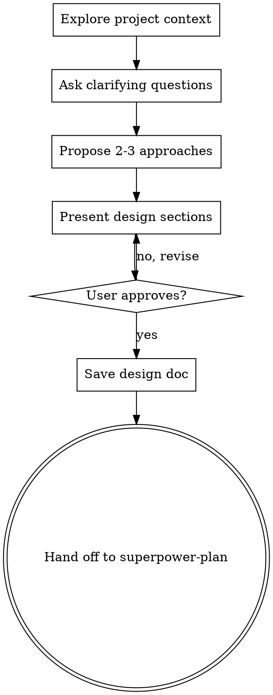

# Brainstorming Ideas Into Designs

## Overview

Turn ideas into fully formed designs through collaborative dialogue. Understand the project, ask questions one at a time, propose approaches, present design, get approval.

<HARD-GATE>
Do NOT write any code, scaffold any project, or take any implementation action until you have presented a design and the user has approved it. This applies to EVERY project regardless of perceived simplicity.
</HARD-GATE>

## The Iron Law

```
NO IMPLEMENTATION WITHOUT AN APPROVED DESIGN FIRST
```

Every project goes through this process. A todo list, a single-function utility, a config change — all of them. "Simple" projects are where unexamined assumptions cause the most wasted work. The design can be short for simple projects, but you MUST present it and get approval.

## Checklist

1. **Explore project context** — check files, docs, recent commits
2. **Ask clarifying questions** — one at a time, understand purpose/constraints/success criteria
3. **Propose 2-3 approaches** — with trade-offs and your recommendation
4. **Present design** — in sections scaled to complexity, get user approval after each section
5. **Save design doc** — to `.github/superpower/brainstorm/YYYY-MM-DD-<topic>-design.md`
6. **Hand off to planning** — use the handoff button to transition to superpower-plan

## Process Flow



**The terminal state is handing off to superpower-plan.** Do NOT write code, create files, or take any implementation action.

## The Process

### Understanding the Idea
- Check project state first (files, docs, recent commits)
- Ask questions one at a time to refine the idea
- Prefer multiple choice questions when possible
- Only one question per message — break complex topics into multiple questions
- Focus on: purpose, constraints, success criteria

### Exploring Approaches
- Propose 2-3 different approaches with trade-offs
- Lead with your recommended option and explain why
- Present conversationally, not as a formal document

### Presenting the Design
- Scale each section to its complexity: a few sentences if straightforward, up to 200-300 words if nuanced
- Ask after each section whether it looks right
- Cover: architecture, components, data flow, error handling, testing
- Go back and clarify if something doesn't make sense

### After Approval
- Save design to `.github/superpower/brainstorm/YYYY-MM-DD-<topic>-design.md`
- Use the handoff button to transition to superpower-plan
- Do NOT invoke any other agent. superpower-plan is the next step.

## Red Flags — STOP

If you catch yourself thinking:
- "This is too simple to need a design" — Simple projects need designs too
- "Let me just start coding" — Design first, always
- "I'll design as I go" — That's not designing, that's hoping
- "The user seems impatient, I'll skip ahead" — Process protects from wasted work
- "I already know the answer" — You know YOUR answer. Ask for THEIRS.

## Common Rationalizations

| Excuse | Reality |
|--------|---------|
| "Too simple for a design" | Simple projects = most wasted assumptions |
| "User already knows what they want" | They know WHAT, not HOW. Explore HOW. |
| "Just a config change" | Config changes break things. Design the change. |
| "I'll design in my head" | Unwritten designs have unexamined assumptions |
| "Multiple choice is patronizing" | Multiple choice saves time and reduces ambiguity |
| "I need to explore code first" | Explore WITH the user, not instead of asking |

## Key Principles

- **One question at a time** — Don't overwhelm
- **Multiple choice preferred** — Easier than open-ended
- **YAGNI ruthlessly** — Remove unnecessary features from all designs
- **Explore alternatives** — Always propose 2-3 approaches
- **Incremental validation** — Present design, get approval before moving on

## Integration

**Hands off to:** superpower-plan (create implementation plan)
**Called by:** User directly when starting any new feature or change
