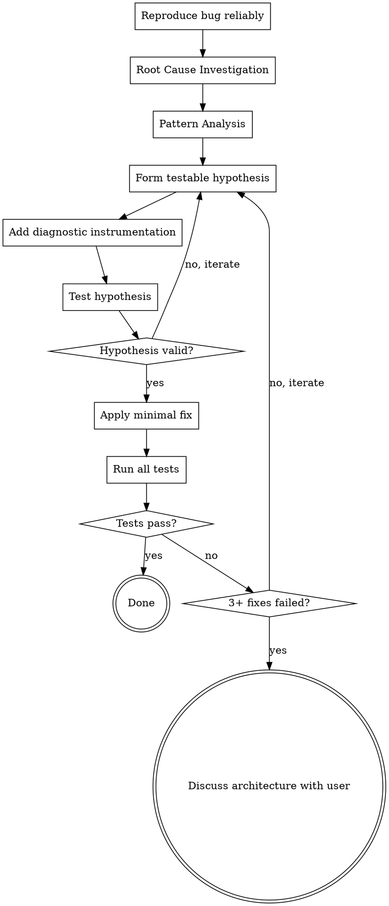

# Systematic Debugging Protocol

## Overview

Debug systematically through root cause investigation, pattern analysis, hypothesis testing, and verified implementation. Never guess at fixes. Never skip instrumentation in multi-component systems.

<HARD-GATE>
NO FIXES WITHOUT ROOT CAUSE INVESTIGATION FIRST. If you cannot identify the root cause, you cannot propose a fix. If 3+ fixes have failed, STOP and question the architecture with the user.
</HARD-GATE>

## The Iron Law

```
NO FIXES WITHOUT ROOT CAUSE INVESTIGATION FIRST
```

Quick fixes create technical debt. "Just try changing X" wastes time. Emergency or not, follow the protocol. The fastest path to resolution is systematic investigation.

## Checklist

1. **Root Cause Investigation** — reproduce, trace execution, read error messages completely, check logs
2. **Pattern Analysis** — search codebase for similar patterns, identify affected components
3. **Hypothesis Testing** — form testable hypothesis, add diagnostic instrumentation, run experiments
4. **Implementation** — apply minimal fix, verify with tests, check for regressions

## Process Flow



## The Process

### Phase 1: Root Cause Investigation (MUST COMPLETE BEFORE PROPOSING FIX)

**Reproduce the bug:**
- Get exact steps to reproduce
- Run the reproduction steps yourself
- Verify you can trigger the bug consistently
- Document the minimal reproduction case

**Trace execution:**
- Read the complete error message (all lines, don't truncate)
- Identify the exact line where it fails
- Check the stack trace for the call path
- Look at values at the failure point

**Check logs:**
- Search for related log messages
- Check timestamps around the failure
- Look for patterns in log output
- Identify what happened right before the failure

**Do NOT propose a fix until you can complete this sentence:**
"The bug occurs because [specific mechanism] causes [specific failure] at [specific location]."

### Phase 2: Pattern Analysis

**Search for similar code:**
- Grep for similar patterns in the codebase
- Check if other areas handle the same case differently
- Identify if this is an isolated issue or systemic

**Identify affected components:**
- List all components involved in the failure path
- Check dependencies between components
- Identify boundary crossings (network, filesystem, database, etc.)

**Multi-component systems require diagnostic instrumentation:**
- Add logging at EACH component boundary
- Log inputs, outputs, and state transitions
- Run the reproduction steps with instrumentation
- Collect diagnostic data BEFORE proposing a fix

### Phase 3: Hypothesis Testing

**Form a testable hypothesis:**
- "I believe X causes Y because Z"
- Must be verifiable through instrumentation or experiments
- Must explain all observed symptoms

**Test the hypothesis:**
- Add targeted instrumentation to verify/refute
- Run controlled experiments
- Compare expected vs actual results
- If hypothesis is wrong, return to Phase 2

**Iterate until hypothesis is confirmed:**
- Don't skip to implementation when uncertain
- Collect evidence that supports your hypothesis
- Rule out alternative explanations

### Phase 4: Implementation

**Apply the minimal fix:**
- Change ONLY what's necessary
- Don't "improve" unrelated code
- Don't add "while I'm here" features
- Keep the change focused and reviewable

**Verify the fix:**
- Run the original reproduction steps
- Verify the bug is gone
- Run all tests (not just the failing one)
- Check for regressions in related functionality

**If tests still fail:**
- Count failed attempts
- If 3+ fixes have failed, STOP
- Question whether you understand the architecture
- Discuss with the user: "We've tried 3 approaches without success. This suggests we may be misunderstanding the system architecture. Let's step back and review the design."

## Red Flags — STOP

If you catch yourself thinking:
- "Let me just try changing X" — No guessing. Investigate first.
- "Quick fix for now, proper fix later" — Proper fix is the only fix.
- "I'm pretty sure it's Y" — Confidence without evidence is rationalization.
- "No time for instrumentation" — Instrumentation saves time by preventing wrong fixes.
- "Emergency, skip protocol" — Emergencies need protocol more, not less.
- "Just one more try" — 3+ attempts failed means wrong approach.

## Common Rationalizations

| Excuse | Reality |
|--------|---------|
| "Quick fix for now" | Quick fixes become permanent debt |
| "Just try changing X" | Guessing wastes more time than investigating |
| "I'm confident" | Confidence ≠ evidence. Verify first. |
| "Emergency, no time" | Protocol prevents emergency from becoming disaster |
| "Small change, low risk" | Unverified changes always carry risk |
| "Already tried instrumentation" | Did you instrument ALL boundaries? Every state transition? |
| "One more attempt" | 3+ failed attempts = fundamentally wrong approach |

## Good Examples

### Example 1: Root Cause Before Fix

```
GOOD:
User: "The test is failing with 'undefined is not a function'"
Agent: "Let me reproduce that first. Running: npm test
[... output shows exact test failure ...]
The error occurs at line 42 in user.service.ts when calling this.validateEmail.
Let me check how validateEmail is defined...
[reads code]
I can see validateEmail is defined as an arrow function in the constructor.
The issue is that 'this' is being accessed before the constructor completes.
This happens because the class is being instantiated during module initialization,
which runs before the constructor assigns the arrow function.
The fix is to convert validateEmail to a class method instead of an arrow function."

BAD:
User: "The test is failing with 'undefined is not a function'"
Agent: "Let me fix that. I'll change line 42 to use bind()."
[No reproduction, no investigation, just guessing]
```

### Example 2: Multi-Component Instrumentation

```
GOOD:
User: "Database queries are failing intermittently"
Agent: "This crosses multiple components (HTTP → Service → Repository → Database).
I'll add logging at each boundary:
1. HTTP layer: log incoming request params
2. Service layer: log query being constructed
3. Repository layer: log exact SQL being executed
4. Database layer: log connection state
Let me add these logs and reproduce the failure..."
[Adds instrumentation, runs tests, collects evidence]
"The logs show the connection pool is exhausted. The root cause is..."

BAD:
Agent: "Probably a timeout issue. Let me increase the timeout value."
[No instrumentation, guessing at multi-component issue]
```

### Example 3: 3+ Failures = Architecture Discussion

```
GOOD:
Agent: "We've now tried 3 different approaches:
1. Increased timeout (tests still fail)
2. Changed query strategy (tests still fail)
3. Added connection pooling (tests still fail)
This suggests we may be misunderstanding how the database layer works.
Let me review the architecture docs and then discuss with you.
[reads architecture]
Looking at the design, I see we're assuming synchronous queries but the
database client is actually async. This fundamental mismatch explains
why our fixes haven't worked. Can we discuss the async strategy?"

BAD:
Agent: "Third attempt failed. Let me try approach #4..."
[Continuing to guess without questioning the approach]
```

## Verification Checklist

Before claiming a bug is fixed:
- [ ] Bug can be reproduced reliably
- [ ] Root cause is identified with specific mechanism
- [ ] Fix addresses root cause, not symptoms
- [ ] All tests pass (not just the failing one)
- [ ] No regressions in related functionality
- [ ] Diagnostic instrumentation has been added (if multi-component)
- [ ] Fix is minimal and focused

## Integration

**Called by:** User when encountering bugs, or by superpower-execute when tests fail
**Standalone agent:** No automatic handoffs, returns control to calling context
