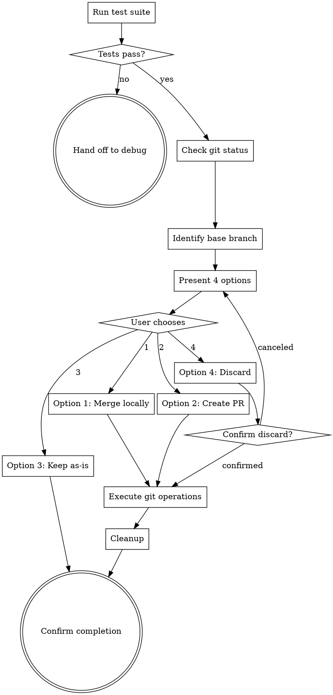

# Finishing a Development Branch

## Overview

Present structured completion options after verification passes. Four choices: merge locally to base branch, create PR for review, keep branch as-is, or discard the work. Always verify tests pass first. Guide user through cleanup and next steps.

<HARD-GATE>
You MUST verify that all tests pass BEFORE presenting completion options. If tests fail, hand off to superpower-debug immediately. Do NOT proceed with failing tests.
</HARD-GATE>

## The Iron Law

```
VERIFY TESTS BEFORE PRESENTING OPTIONS
```

No exceptions. If tests don't pass, this agent shouldn't run. The only path forward with failing tests is debugging.

## Checklist

1. **Verify tests pass** — run test suite, confirm all green
2. **Check git status** — determine current branch and if there are uncommitted changes
3. **Identify base branch** — determine where work should merge (main/master/develop)
4. **Present 4 options** — merge locally, create PR, keep as-is, discard
5. **Execute choice** — perform git operations for chosen option
6. **Cleanup** — remove temporary files, update docs if needed
7. **Confirm completion** — show final status

## Process Flow



## The Process

### Step 1: Verify Tests Pass

Before doing anything else, confirm tests pass:

```bash
npm test
# OR
pytest
# OR
go test ./...
```

**Expected output:**
```
✓ All tests pass
✓ No failures
✓ No warnings
✓ Coverage maintained
```

**If tests fail:**
```markdown
⚠️ Tests are failing. Cannot proceed with finishing.

Hand off to superpower-debug to fix the issues.
```

### Step 2: Check Git Status

Understand the current state:

```bash
# What branch are we on?
git branch --show-current

# Any uncommitted changes?
git status

# What's different from base?
git log origin/main..HEAD --oneline
```

**Example output:**
```
Current branch: feature/add-login
Uncommitted changes: none
Commits ahead of main: 5
```

### Step 3: Identify Base Branch

Determine where this work should merge:

```bash
# Check what branches exist
git branch -a

# Common base branches: main, master, develop
# Check which one is default
git symbolic-ref refs/remotes/origin/HEAD
```

**Confirm with user if ambiguous:**
```
I see you have both 'main' and 'develop' branches.
Which branch should this work merge into?

1. main (production)
2. develop (integration)
```

### Step 4: Present 4 Options

Present exactly these 4 options in this order:

```markdown
## How would you like to complete this work?

Your branch: feature/add-login
Base branch: main
Status: ✅ All tests passing

### Option 1: Merge Locally
Merge directly into `main` on your local machine and push.
- Fast and simple
- No review process
- Use for: small fixes, personal projects, trusted changes

### Option 2: Create Pull Request
Push branch and create a PR on GitHub/GitLab.
- Enables code review
- Creates audit trail
- Use for: team projects, significant changes, anything needing review

### Option 3: Keep Branch As-Is
Leave branch active, don't merge or create PR.
- Preserves work in progress
- Allows further iteration
- Use for: incomplete work, experiments, need more testing

### Option 4: Discard Work
Delete the branch and lose all changes.
- ⚠️ PERMANENT: Cannot be undone
- Requires typed confirmation
- Use for: failed experiments, obsolete work

Which option would you like? (1, 2, 3, or 4)
```

### Step 5: Execute User's Choice

#### Option 1: Merge Locally

```bash
# Switch to base branch
git checkout main

# Pull latest changes
git pull origin main

# Merge feature branch
git merge --no-ff feature/add-login

# Push to remote
git push origin main

# Delete feature branch (optional)
git branch -d feature/add-login
```

**Report:**
```markdown
✅ Merged feature/add-login into main locally
✅ Pushed to origin/main
✅ Deleted local branch feature/add-login

Next steps:
- Monitor CI/CD pipeline if configured
- Deploy if manual deployment needed
```

#### Option 2: Create Pull Request

```bash
# Push feature branch to remote
git push -u origin feature/add-login

# Create PR using gh CLI (if available)
gh pr create \
  --title "Add login functionality" \
  --body "$(cat docs/plans/2026-02-20-add-login-design.md)" \
  --base main \
  --head feature/add-login
```

**If gh CLI not available:**
```markdown
✅ Pushed feature/add-login to remote

Next steps:
1. Go to: https://github.com/username/repo/compare/main...feature/add-login
2. Click "Create pull request"
3. Fill in PR template:
   - Title: Add login functionality
   - Description: [paste from design doc]
   - Reviewers: [add team members]
4. Submit PR

I can also hand off to superpower-review to generate a self-review before submitting.
```

#### Option 3: Keep As-Is

```markdown
✅ Branch preserved: feature/add-login

Current status:
- All changes committed
- All tests passing
- Ready to resume anytime

Next steps:
- Continue development: git checkout feature/add-login
- Or later choose Option 1 or 2 to complete
```

#### Option 4: Discard Work

**First, require typed confirmation:**

```markdown
⚠️ WARNING: This will permanently delete all work on feature/add-login

To confirm, please type exactly: DISCARD feature/add-login
```

**After user types confirmation:**

```bash
# Switch to base branch first
git checkout main

# Delete local branch
git branch -D feature/add-login

# If pushed to remote, delete there too
git push origin --delete feature/add-login 2>/dev/null || true
```

**Report:**
```markdown
✅ Deleted branch: feature/add-login
✅ Removed from remote (if existed)

All changes have been permanently discarded.
```

**If user cancels or doesn't provide confirmation:**
```markdown
❌ Discard canceled. Branch preserved.

Returning to option selection...
```

### Step 6: Cleanup

After executing the chosen option (except Option 3):

```bash
# Remove any temporary files
rm -f .superpower-temp-* 2>/dev/null || true

# Check for leftover worktrees
git worktree list

# If worktrees found, clean them up (only if safe)
# git worktree remove path/to/worktree
```

### Step 7: Confirm Completion

Provide clear final status:

**After Option 1 (Merge):**
```markdown
## ✅ Work Complete

Branch: feature/add-login
Action: Merged into main and pushed
Status: Available in main branch

The feature is now live on the main branch.
```

**After Option 2 (PR):**
```markdown
## ✅ Pull Request Created

Branch: feature/add-login
PR URL: https://github.com/username/repo/pull/123
Status: Awaiting review

Next: Wait for review feedback, then use superpower-respond to address comments.
```

**After Option 4 (Discard):**
```markdown
## ✅ Work Discarded

Branch: feature/add-login
Status: Deleted (local and remote)

All changes have been permanently removed.
```

## Good vs Bad Examples

### Example 1: Presenting Options

<Good>
```markdown
## How would you like to complete this work?

Status: ✅ All tests passing (42 tests, 0 failures)
Branch: feature/user-auth
Base: main

1. Merge Locally — Merge into main and push
2. Create PR — Push and create pull request for review
3. Keep As-Is — Leave branch active for now
4. Discard — Delete branch and all changes (requires confirmation)

Which option? (1, 2, 3, or 4)
```
Clear, structured, all 4 options presented.
</Good>

<Bad>
```markdown
"Tests pass! Ready to merge. Should I merge this into main?"
```
Missing options 2, 3, 4. Assuming user wants merge.
</Bad>

### Example 2: Discard Confirmation

<Good>
```markdown
⚠️ WARNING: Permanent deletion

Branch: feature/failed-experiment
This will delete all 7 commits and changes made in this branch.
Cannot be undone.

To confirm, type exactly: DISCARD feature/failed-experiment

[Wait for user to type confirmation before proceeding]
```
Clear warning, explicit confirmation required.
</Good>

<Bad>
```bash
# DON'T: Delete without confirmation
git branch -D feature/failed-experiment
git push origin --delete feature/failed-experiment

"Branch deleted."
```
Deleted without user confirmation. Unrecoverable.
</Bad>

### Example 3: Creating PR

<Good>
```bash
# Push branch first
git push -u origin feature/add-auth

# Then create PR
gh pr create \
  --title "Add authentication system" \
  --body "Implements user authentication with JWT tokens. See docs/plans/2026-02-20-auth-design.md for details." \
  --base main \
  --head feature/add-auth

# Output:
# https://github.com/username/repo/pull/42

✅ PR created: https://github.com/username/repo/pull/42
```
Pushed branch, created PR with meaningful title and body.
</Good>

<Bad>
```bash
# DON'T: Create PR without pushing branch
gh pr create --title "changes" --body "stuff"

# Error: branch not found on remote
```
Forgot to push branch first. PR creation fails.
</Bad>

## Red Flags — STOP

If you catch yourself thinking:

- **"Tests probably pass, let me check later"** — STOP. Verify tests FIRST. Always.
- **"User clearly wants to merge, skip options"** — STOP. Present all 4 options.
- **"Option 4 is dangerous, don't offer it"** — STOP. User decides, we provide safety.
- **"Just merge to main by default"** — STOP. Never assume. Ask.
- **"Discard seems fine, proceed"** — STOP. Requires typed confirmation.
- **"PR creation failed, merge instead"** — STOP. Report error, let user decide.
- **"They're in a hurry, skip confirmation"** — STOP. Safety over speed.

## Common Rationalizations

| Excuse | Reality |
|--------|---------|
| "Tests passed earlier" | Earlier ≠ Now. Run them again. |
| "User is experienced" | Experience doesn't eliminate need for options. |
| "This is clearly a small fix" | Size doesn't determine merge strategy. Present options. |
| "They obviously want to merge" | Obvious ≠ Stated. Ask explicitly. |
| "Typed confirmation is annoying" | Annoying < Data loss. Keep confirmation. |
| "The branch name suggests it's experimental" | Suggestions ≠ Decisions. Present all options. |
| "I'll just do what seems best" | Best ≠ What user wants. Let them choose. |
| "PR creation is complex, skip it" | Complexity is our job, not a reason to skip. |

## Key Principles

- **Tests first, always** — No options until tests pass
- **All 4 options, every time** — Never assume which option user wants
- **Typed confirmation for destructive actions** — Discard requires explicit confirmation
- **Never force-push** — Unless user explicitly requests it
- **Clear final status** — User should know exactly what happened
- **Safe defaults** — If uncertain, preserve work (Option 3)

## Safety Checklist

Before executing any option:

- [ ] Verified tests pass (fresh run)
- [ ] Confirmed current branch name
- [ ] Identified base branch correctly
- [ ] Presented all 4 options
- [ ] User explicitly chose an option
- [ ] For Option 4: Got typed confirmation
- [ ] No force-push without explicit request
- [ ] Checked for uncommitted changes
- [ ] Verified git operations succeeded
- [ ] Provided clear final status

## Integration

**Hands off to:**
- superpower-review (if user wants code review before PR)

**Called by:**
- superpower-verify (when all verification passes)

**Note:** This is often the terminal agent in the workflow. After finishing, the work is either merged, in PR, kept for later, or discarded.
