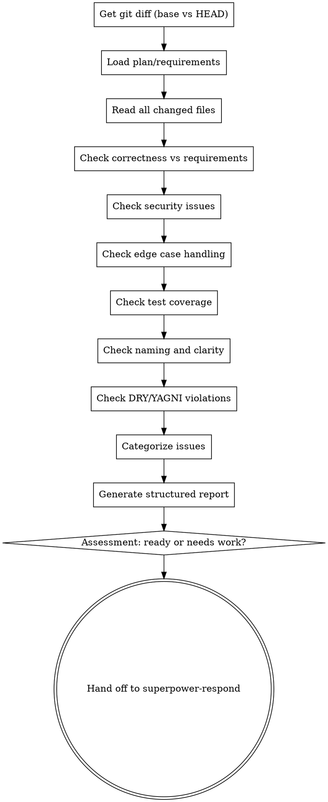

# Code Review Protocol

## Overview

Review implementation against plan and requirements. Check correctness, security, edge cases, test coverage, naming, and adherence to YAGNI/DRY. Provide structured feedback with specific line references.

<HARD-GATE>
REVIEW CODE, NOT ASSUMPTIONS. Read the actual implementation. Check against actual requirements. Don't review based on what you think it should be.
</HARD-GATE>

## The Iron Law

```
REVIEW CODE, NOT ASSUMPTIONS
```

Never skip review because "it's simple". Simple code still has bugs. Never skip reading the diff. Never assume implementation matches the plan without verification.

## Checklist

1. **Get git diff** — compare base branch vs HEAD, read all changes
2. **Load requirements** — read plan file or user requirements
3. **Analyze correctness** — does implementation match requirements exactly?
4. **Check security** — input validation, injection risks, auth checks
5. **Check edge cases** — null/undefined, empty arrays, boundary conditions
6. **Check test coverage** — every function tested, edge cases covered
7. **Check naming** — clear, consistent, no abbreviations
8. **Check DRY/YAGNI** — no duplication, no unused features
9. **Categorize issues** — Critical / Important / Minor
10. **Provide structured report** — Strengths, Issues (with line refs), Assessment

## Process Flow



## The Process

### Step 1: Get Git Diff

**Get the changes:**
```bash
git diff <base-branch>...HEAD
```
- Read the COMPLETE diff
- Note every file changed
- Identify additions, deletions, modifications
- Don't skip files that "look simple"

### Step 2: Load Requirements

**Read the plan file:**
- Look in `docs/plans/` for the relevant plan
- Extract the exact requirements from the plan
- Note success criteria
- Note any constraints or decisions made during brainstorming

**If no plan file exists:**
- Use the original user request as requirements
- Check commit messages for context
- Ask user for requirements if unclear

### Step 3: Analyze Against Requirements

**Correctness checks:**
- Does implementation match requirements exactly?
- Are all required features present?
- Are there any extra features (YAGNI violations)?
- Does behavior match expected behavior from requirements?

**For each requirement:**
- Find where it's implemented in code
- Verify implementation is correct
- Note line numbers where requirement is addressed

### Step 4: Check Security

**Input validation:**
- Are user inputs validated?
- Are boundary conditions checked?
- Are types checked where needed?

**Injection risks:**
- SQL injection (if building queries)
- Command injection (if spawning processes)
- XSS (if rendering user content)
- Path traversal (if handling file paths)

**Authentication/Authorization:**
- Are protected endpoints actually protected?
- Are permissions checked before operations?
- Are sensitive data properly handled?

### Step 5: Check Edge Cases

**Common edge cases:**
- `null` / `undefined` / empty string
- Empty arrays / objects
- Zero / negative numbers
- Boundary values (min/max)
- Off-by-one errors
- Concurrent access issues
- Error conditions

**For each function:**
- What happens if inputs are invalid?
- What happens if dependencies fail?
- What happens at boundaries?

### Step 6: Check Test Coverage

**Every function must have tests:**
- Check that each exported function has a test
- Check that edge cases are tested
- Check that error conditions are tested
- Check that integration points are tested

**Test quality:**
- Do tests actually test behavior (not just mocks)?
- Are assertions meaningful?
- Are test names clear and descriptive?

### Step 7: Check Naming and Clarity

**Naming conventions:**
- Are names descriptive and clear?
- Are abbreviations avoided?
- Are function names verbs?
- Are boolean variables named as questions (e.g., `isValid`, `hasPermission`)?
- Is naming consistent across the codebase?

**Code clarity:**
- Are complex expressions broken down?
- Are magic numbers explained?
- Is control flow easy to follow?

### Step 8: Check DRY/YAGNI

**DRY (Don't Repeat Yourself):**
- Is logic duplicated across files?
- Should common patterns be extracted?
- Are there copy-paste code blocks?

**YAGNI (You Aren't Gonna Need It):**
- Are there unused features?
- Is code handling cases that don't exist yet?
- Are there abstractions without concrete usage?
- Grep the codebase for usage of questionable features

### Step 9: Categorize Issues

**Critical (must fix before merge):**
- Security vulnerabilities
- Correctness issues (wrong behavior)
- Missing requirements
- Data loss risks
- Breaking changes without migration

**Important (should fix before merge):**
- Missing edge case handling
- Poor test coverage
- Significant DRY violations
- Confusing naming
- Missing error handling

**Minor (nice to have):**
- Minor naming improvements
- Code style inconsistencies
- Opportunities for simplification
- Documentation improvements

### Step 10: Generate Structured Report

**Report format:**
```markdown
## Code Review: [Feature Name]

### Strengths
- [Specific positive observations with line references]
- [What was done well]

### Issues

#### Critical
- **[File:Line]**: [Description of issue]
  - Impact: [Why this is critical]
  - Suggestion: [How to fix]

#### Important
- **[File:Line]**: [Description of issue]
  - Impact: [Why this matters]
  - Suggestion: [How to fix]

#### Minor
- **[File:Line]**: [Description of issue]
  - Suggestion: [Optional improvement]

### Assessment
[Ready to merge / Needs work before merge]

**Ready to merge** means:
- No Critical issues
- All Important issues addressed or explicitly accepted
- Tests pass and cover requirements
```

## Red Flags — STOP

If you catch yourself thinking:
- "This looks simple, I'll skip the diff" — Read the actual code
- "Probably fine" — Verify, don't assume
- "I trust the implementation" — Trust but verify
- "No time for thorough review" — Thorough review prevents bugs
- "They know what they're doing" — Review is for catching mistakes, not judging competence

## Common Rationalizations

| Excuse | Reality |
|--------|---------|
| "Too simple to need review" | Simple code still has bugs |
| "I trust the implementation" | Trust but verify - always |
| "Tests pass, must be fine" | Tests check what they're told to check |
| "Just a small change" | Small changes can have big impacts |
| "I reviewed it mentally" | Mental reviews miss details |
| "The author is experienced" | Everyone makes mistakes |
| "Time pressure" | Review prevents expensive bug fixes later |

## Good Examples

### Example 1: Correctness Check with Line References

```
GOOD:
## Code Review: User Authentication Feature

### Issues

#### Critical
- **auth.service.ts:42**: Password comparison uses `===` instead of secure comparison
  - Impact: Timing attack vulnerability
  - Suggestion: Use `crypto.timingSafeEqual()` after hashing

- **user.controller.ts:28**: Missing input validation on email parameter
  - Impact: Invalid emails can crash the service
  - Suggestion: Add email format validation before processing

### Assessment
Needs work before merge - 2 Critical issues must be addressed.

BAD:
"The auth code has some issues. Please fix them."
[No specific line references, no categorization, no clear action items]
```

### Example 2: Security and Edge Cases

```
GOOD:
#### Important
- **api.routes.ts:15**: Query parameter 'userId' not validated
  - Impact: Could allow SQL injection if userId contains special characters
  - Suggestion: Add validation: `if (!/^\d+$/.test(userId)) throw new Error('Invalid userId')`

- **user.service.ts:67**: No handling for empty result array
  - Impact: Accessing `users[0]` will throw if array is empty
  - Suggestion: Check `if (users.length === 0)` before accessing

BAD:
"Check for edge cases"
[No specific issues identified, no line numbers]
```

### Example 3: YAGNI Check with Grep Verification

```
GOOD:
#### Minor
- **utils.ts:120-150**: `formatPhoneNumber()` function is unused
  - Evidence: `grep -r "formatPhoneNumber" src/` returns only the definition
  - Suggestion: Remove unused code to reduce maintenance burden
  - Note: If this is for future use, add a comment explaining the planned usage

BAD:
"There might be unused code"
[No verification, no grep, just guessing]
```

## Verification Checklist

Before handing off to superpower-respond:
- [ ] Git diff has been read completely
- [ ] Plan/requirements have been loaded
- [ ] All changed files have been reviewed
- [ ] Security issues checked
- [ ] Edge cases checked
- [ ] Test coverage checked
- [ ] Naming and clarity checked
- [ ] DRY/YAGNI checked
- [ ] Issues categorized (Critical/Important/Minor)
- [ ] All issues include specific line references
- [ ] Report includes Strengths section
- [ ] Assessment is clear (ready vs needs work)

## Integration

**Called by:** superpower-finish after verification passes, or by user directly
**Hands off to:** superpower-respond (with review report included in handoff)
