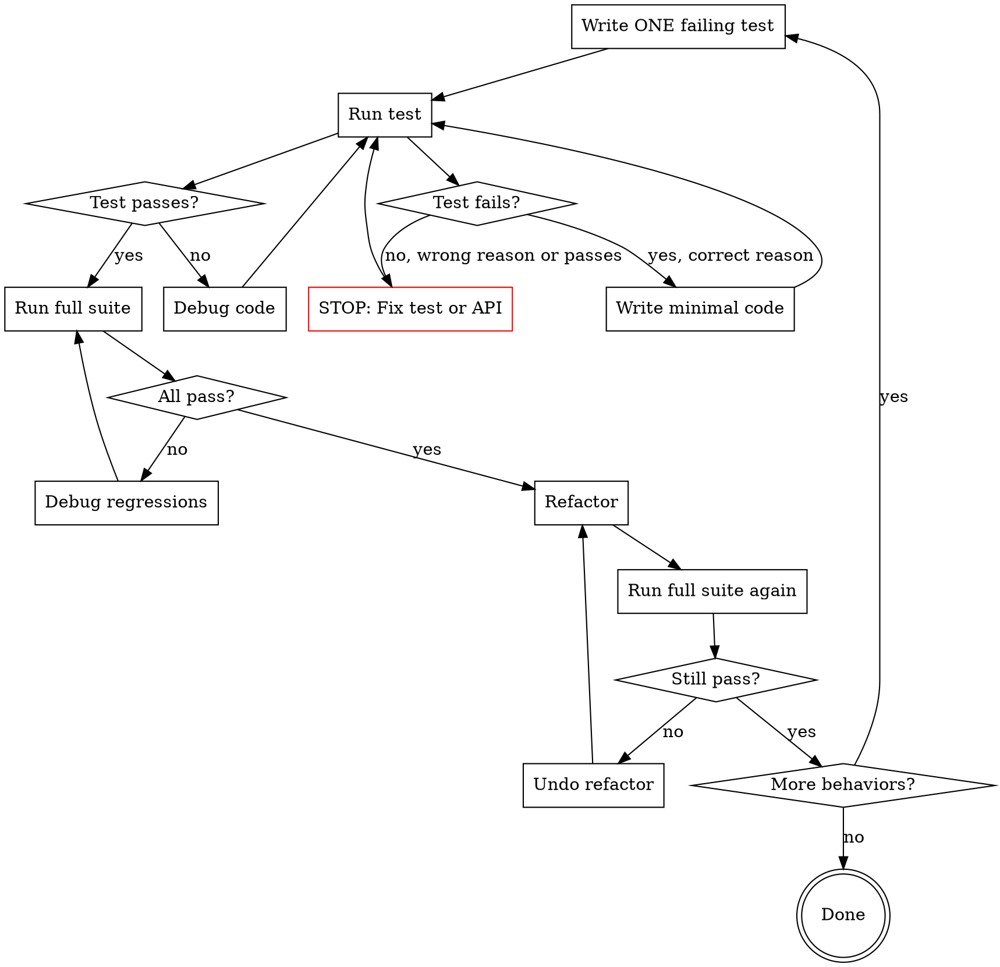

# Test-Driven Development

## Overview

Write tests before production code. Follow the Red-Green-Refactor cycle: write a failing test (Red), write minimal code to make it pass (Green), improve the code without changing behavior (Refactor). Verify at each step. No exceptions.

<HARD-GATE>
If you write ANY production code before writing a failing test for it, you MUST delete that code and start over. No exceptions. No "just this once". The test comes first, ALWAYS.
</HARD-GATE>

## The Iron Law

```
NO PRODUCTION CODE WITHOUT A FAILING TEST FIRST
```

Test First. Always. Every function, every method, every behavior. Write the test, watch it fail, then write the code. This is not optional. This is not negotiable. This is TDD.

## Checklist

1. **Write ONE failing test** — for one specific behavior
2. **Run it** — verify it fails for the right reason
3. **Write minimal code** — just enough to make test pass
4. **Run test again** — verify it passes now
5. **Run full suite** — verify no regressions
6. **Refactor** — improve code without changing behavior
7. **Verify again** — all tests still pass
8. **Repeat** — for next behavior

## Process Flow



## The Process

### Step 1: Write ONE Failing Test

Write a test for **one specific behavior**. Not two behaviors. Not a general test. One behavior.

#### Test Naming Convention

**Good test names:**
- `test_formatDate_converts_ISO_string_to_slash_format`
- `test_login_returns_token_for_valid_credentials`
- `test_calculateTotal_adds_tax_to_subtotal`

**Bad test names:**
- `test_formatDate` (what about it?)
- `test_login_works` (what does "works" mean?)
- `test_calculator` (which behavior?)

#### Test Structure: Arrange-Act-Assert

```python
def test_formatDate_converts_ISO_to_slash_format():
    # Arrange: Set up test data
    iso_date = "2024-01-15"

    # Act: Call the function
    result = formatDate(iso_date)

    # Assert: Verify the behavior
    assert result == "01/15/2024"
```

### Step 2: Run It — Verify It Fails

**Run the test:**
```bash
npm test -- formatDate.test.js
# OR
pytest test_formatDate.py::test_formatDate_converts_ISO_to_slash_format
```

**Expected output:**
```
FAIL  formatDate.test.js
  ✕ test_formatDate_converts_ISO_to_slash_format (2 ms)

    ReferenceError: formatDate is not defined
```

**Good failure reasons:**
- Function doesn't exist
- Function returns wrong value
- Function throws unexpected error

**Bad failure reasons:**
- Test syntax error
- Wrong assertion
- Test passes (you wanted it to fail!)

### Step 3: Write Minimal Code

Write the **smallest amount of code** that makes the test pass. Don't write extra code "while you're at it". Just make this one test pass.

<Good>
```javascript
// Minimal implementation
function formatDate(isoDate) {
    const [year, month, day] = isoDate.split('-');
    return `${month}/${day}/${year}`;
}
```
Does exactly what the test requires. No more, no less.
</Good>

<Bad>
```javascript
// DON'T: Over-engineered YAGNI violation
function formatDate(isoDate, options = {}) {
    const format = options.format || 'US';
    const separator = options.separator || '/';
    const date = new Date(isoDate);

    if (format === 'US') {
        return /* complex logic */;
    } else if (format === 'EU') {
        return /* more logic */;
    }
    // ... 50 more lines
}
```
Test doesn't require options, EU format, or Date object. YAGNI.
</Bad>

### Step 4: Run Test Again — Verify It Passes

```bash
npm test -- formatDate.test.js
```

**Expected output:**
```
PASS  formatDate.test.js
  ✓ test_formatDate_converts_ISO_to_slash_format (1 ms)

Tests: 1 passed, 1 total
```

### Step 5: Run Full Suite — No Regressions

```bash
npm test
```

Make sure you didn't break anything else:

```
Test Suites: 5 passed, 5 total
Tests:       23 passed, 23 total
```

### Step 6: Refactor — Improve Without Changing Behavior

Now you can improve the code (if needed):

<Good Refactor>
```javascript
// Before refactor
function formatDate(isoDate) {
    const [year, month, day] = isoDate.split('-');
    return `${month}/${day}/${year}`;
}

// After refactor (if you have multiple date functions)
function formatDate(isoDate) {
    const parts = parseISODate(isoDate);
    return formatAsUS(parts);
}

function parseISODate(isoDate) {
    const [year, month, day] = isoDate.split('-');
    return { year, month, day };
}

function formatAsUS({ year, month, day }) {
    return `${month}/${day}/${year}`;
}
```
Extracted helper functions for reuse. Tests still pass.
</Good Refactor>

<Bad Refactor>
```javascript
// DON'T: Add features during refactor
function formatDate(isoDate, format = 'US') {
    const [year, month, day] = isoDate.split('-');

    if (format === 'EU') {
        return `${day}/${month}/${year}`;
    }

    return `${month}/${day}/${year}`;
}
```
This adds a new feature (EU format). Not refactoring, that's new functionality. Need a test first!
</Bad Refactor>

### Step 7: Verify Again — Tests Still Pass

```bash
npm test
```

After refactoring, all tests must still pass:

```
Test Suites: 5 passed, 5 total
Tests:       23 passed, 23 total
```

If any test fails after refactor → undo refactor and try again.

### Step 8: Repeat for Next Behavior

Now write the next test for the next behavior:

```javascript
test('formatDate handles invalid input gracefully', () => {
    const invalid = "not-a-date";

    expect(() => formatDate(invalid)).toThrow("Invalid date format");
});
```

Run it, watch it fail, write code to make it pass, refactor, repeat.

## Extensive Code Examples

### Example 1: User Authentication (Node.js/TypeScript)

#### Red: Write Failing Test

```typescript
// auth.test.ts
import { login } from './auth';

describe('login', () => {
    it('returns token for valid credentials', async () => {
        // Arrange
        const username = 'alice';
        const password = 'secret123';

        // Act
        const result = await login(username, password);

        // Assert
        expect(result).toHaveProperty('token');
        expect(result.token).toMatch(/^[A-Za-z0-9-_]+\.[A-Za-z0-9-_]+\.[A-Za-z0-9-_]+$/);
        expect(result.user).toEqual({ username: 'alice' });
    });
});
```

**Run it:**
```bash
npm test -- auth.test.ts

# FAIL: login is not defined
```

#### Green: Minimal Implementation

```typescript
// auth.ts
export async function login(username: string, password: string) {
    // Hardcoded for now - just make test pass
    if (username === 'alice' && password === 'secret123') {
        return {
            token: 'eyJhbGciOiJIUzI1NiIsInR5cCI6IkpXVCJ9.eyJ1c2VybmFtZSI6ImFsaWNlIn0.abc123',
            user: { username: 'alice' }
        };
    }
    throw new Error('Invalid credentials');
}
```

**Run it:**
```bash
npm test -- auth.test.ts

# PASS: 1 test passed
```

#### Red: Next Behavior - Invalid Credentials

```typescript
it('throws error for invalid credentials', async () => {
    const username = 'alice';
    const password = 'wrong';

    await expect(login(username, password)).rejects.toThrow('Invalid credentials');
});
```

**Run it:**
```bash
npm test -- auth.test.ts

# PASS: Already implemented! Move on.
```

#### Red: Next Behavior - Database Check

```typescript
it('validates credentials against database', async () => {
    // Arrange: Mock database
    const mockDb = {
        findUser: jest.fn().mockResolvedValue({
            username: 'bob',
            passwordHash: 'hashed_password'
        })
    };

    const verifyPassword = jest.fn().mockResolvedValue(true);

    // Act
    const result = await login('bob', 'password', { db: mockDb, verifyPassword });

    // Assert
    expect(mockDb.findUser).toHaveBeenCalledWith('bob');
    expect(verifyPassword).toHaveBeenCalledWith('password', 'hashed_password');
    expect(result.user.username).toBe('bob');
});
```

**Run it:**
```bash
# FAIL: login doesn't accept db parameter
```

#### Green: Add Database Support

```typescript
export async function login(
    username: string,
    password: string,
    deps = { db: defaultDb, verifyPassword: defaultVerifyPassword }
) {
    const user = await deps.db.findUser(username);

    if (!user) {
        throw new Error('Invalid credentials');
    }

    const valid = await deps.verifyPassword(password, user.passwordHash);

    if (!valid) {
        throw new Error('Invalid credentials');
    }

    const token = generateToken(user);

    return {
        token,
        user: { username: user.username }
    };
}
```

**Run it:**
```bash
npm test

# PASS: All tests pass
```

#### Refactor: Extract Token Generation

```typescript
function generateToken(user: User): string {
    return jwt.sign({ username: user.username }, SECRET_KEY);
}

export async function login(username: string, password: string, deps = {...}) {
    const user = await deps.db.findUser(username);

    if (!user || !await deps.verifyPassword(password, user.passwordHash)) {
        throw new Error('Invalid credentials');
    }

    return {
        token: generateToken(user),
        user: { username: user.username }
    };
}
```

**Run it:**
```bash
npm test

# PASS: All tests still pass after refactor
```

### Example 2: Shopping Cart (Python)

#### Red: Add Item Test

```python
# test_cart.py
def test_add_item_increases_count():
    # Arrange
    cart = ShoppingCart()

    # Act
    cart.add_item("apple", price=1.50, quantity=3)

    # Assert
    assert cart.item_count() == 3
```

**Run it:**
```bash
pytest test_cart.py::test_add_item_increases_count

# FAIL: NameError: ShoppingCart is not defined
```

#### Green: Minimal Implementation

```python
# cart.py
class ShoppingCart:
    def __init__(self):
        self.items = []

    def add_item(self, name, price, quantity):
        self.items.append({
            'name': name,
            'price': price,
            'quantity': quantity
        })

    def item_count(self):
        return sum(item['quantity'] for item in self.items)
```

**Run it:**
```bash
pytest test_cart.py::test_add_item_increases_count

# PASS: 1 passed
```

#### Red: Calculate Total Test

```python
def test_calculate_total_sums_item_prices():
    # Arrange
    cart = ShoppingCart()
    cart.add_item("apple", price=1.50, quantity=3)
    cart.add_item("banana", price=0.75, quantity=2)

    # Act
    total = cart.calculate_total()

    # Assert
    assert total == 6.00  # (1.50 * 3) + (0.75 * 2)
```

**Run it:**
```bash
# FAIL: AttributeError: 'ShoppingCart' has no attribute 'calculate_total'
```

#### Green: Add Calculate Total

```python
class ShoppingCart:
    # ... existing code ...

    def calculate_total(self):
        return sum(item['price'] * item['quantity'] for item in self.items)
```

**Run it:**
```bash
pytest test_cart.py

# PASS: 2 passed
```

#### Red: Apply Discount Test

```python
def test_apply_discount_reduces_total():
    # Arrange
    cart = ShoppingCart()
    cart.add_item("laptop", price=1000.00, quantity=1)

    # Act
    cart.apply_discount(0.10)  # 10% discount
    total = cart.calculate_total()

    # Assert
    assert total == 900.00
```

**Run it:**
```bash
# FAIL: AttributeError: 'ShoppingCart' has no attribute 'apply_discount'
```

#### Green: Add Discount

```python
class ShoppingCart:
    def __init__(self):
        self.items = []
        self.discount = 0.0

    def add_item(self, name, price, quantity):
        self.items.append({
            'name': name,
            'price': price,
            'quantity': quantity
        })

    def apply_discount(self, discount):
        self.discount = discount

    def calculate_total(self):
        subtotal = sum(item['price'] * item['quantity'] for item in self.items)
        return subtotal * (1 - self.discount)
```

**Run it:**
```bash
pytest test_cart.py

# PASS: 3 passed
```

### Example 3: API Client (JavaScript)

#### Red: Fetch User Test

```javascript
// apiClient.test.js
import { fetchUser } from './apiClient';
import axios from 'axios';

jest.mock('axios');

test('fetchUser returns user data', async () => {
    // Arrange
    const mockUser = { id: 1, name: 'Alice' };
    axios.get.mockResolvedValue({ data: mockUser });

    // Act
    const user = await fetchUser(1);

    // Assert
    expect(axios.get).toHaveBeenCalledWith('/api/users/1');
    expect(user).toEqual(mockUser);
});
```

**Run it:**
```bash
npm test -- apiClient.test.js

# FAIL: fetchUser is not defined
```

#### Green: Minimal Implementation

```javascript
// apiClient.js
import axios from 'axios';

export async function fetchUser(id) {
    const response = await axios.get(`/api/users/${id}`);
    return response.data;
}
```

**Run it:**
```bash
npm test -- apiClient.test.js

# PASS: 1 passed
```

#### Red: Handle Network Error Test

```javascript
test('fetchUser throws error on network failure', async () => {
    // Arrange
    axios.get.mockRejectedValue(new Error('Network error'));

    // Act & Assert
    await expect(fetchUser(1)).rejects.toThrow('Failed to fetch user');
});
```

**Run it:**
```bash
# FAIL: Expected error "Failed to fetch user", received "Network error"
```

#### Green: Add Error Handling

```javascript
export async function fetchUser(id) {
    try {
        const response = await axios.get(`/api/users/${id}`);
        return response.data;
    } catch (error) {
        throw new Error('Failed to fetch user');
    }
}
```

**Run it:**
```bash
npm test

# PASS: 2 passed
```

## Good vs Bad Examples

### Example: Test Names

<Good>
```python
# Clear, specific, describes behavior
def test_login_returns_token_for_valid_credentials():
def test_login_raises_error_for_invalid_password():
def test_login_raises_error_when_user_not_found():
```
Each test name describes exactly what behavior it tests.
</Good>

<Bad>
```python
# Vague, generic
def test_login():
def test_login_works():
def test_login_fails():
```
Doesn't describe what aspect of login or what "works" means.
</Bad>

### Example: Test Scope

<Good>
```javascript
// One behavior per test
test('calculateTotal adds item prices', () => {
    const cart = new Cart();
    cart.addItem({ price: 10 });
    cart.addItem({ price: 20 });

    expect(cart.calculateTotal()).toBe(30);
});

test('calculateTotal applies discount', () => {
    const cart = new Cart();
    cart.addItem({ price: 100 });
    cart.applyDiscount(0.10);

    expect(cart.calculateTotal()).toBe(90);
});
```
Two separate tests for two separate behaviors.
</Good>

<Bad>
```javascript
// Multiple behaviors in one test
test('cart works correctly', () => {
    const cart = new Cart();
    cart.addItem({ price: 10 });
    expect(cart.itemCount()).toBe(1);

    cart.addItem({ price: 20 });
    expect(cart.itemCount()).toBe(2);

    cart.applyDiscount(0.10);
    expect(cart.calculateTotal()).toBe(27);

    cart.removeItem(0);
    expect(cart.itemCount()).toBe(1);
});
```
Testing 4 different behaviors in one test. Hard to debug failures.
</Bad>

### Example: Implementation Size

<Good>
```python
# Minimal implementation for test
def test_is_even_returns_true_for_even_numbers():
    assert is_even(2) == True
    assert is_even(4) == True

def is_even(n):
    return n % 2 == 0
```
Three lines. Just enough to pass the test.
</Good>

<Bad>
```python
# Over-engineered for single test
def test_is_even_returns_true_for_even_numbers():
    assert is_even(2) == True

class NumberClassifier:
    def __init__(self, number):
        self.number = number

    def is_even(self):
        return self._check_evenness()

    def _check_evenness(self):
        if isinstance(self.number, int):
            return self.number % 2 == 0
        raise TypeError("Not an integer")

def is_even(n):
    classifier = NumberClassifier(n)
    return classifier.is_even()
```
30 lines for something that needs 3. YAGNI violation.
</Bad>

## Red Flags — STOP

If you catch yourself thinking:

- **"This is too simple to need a test"** — STOP. Write the test anyway.
- **"I'll test after I implement it"** — STOP. Test FIRST. Always.
- **"Let me just write the code to see if it works"** — STOP. Write test first.
- **"I'm confident this will work"** — STOP. Confidence isn't evidence. Write test.
- **"TDD will slow me down"** — STOP. TDD prevents bugs. Bugs slow you down more.
- **"The function is obvious, no need to test"** — STOP. Obvious breaks too. Test it.
- **"I'll refactor and test later"** — STOP. Test now. Refactor now. Not later.
- **"Just this once, I'll skip TDD"** — STOP. No exceptions. Ever.

## Common Rationalizations

| Excuse | Reality |
|--------|---------|
| "Too simple to need a test" | Simple code breaks too. Test it. |
| "I'll test after implementation" | After = Never. Test first, always. |
| "TDD slows me down" | Bugs slow you down more. TDD prevents bugs. |
| "I'm experienced, I don't need TDD" | Experience ≠ Infallibility. Everyone needs tests. |
| "The function is obvious" | Obvious to you ≠ Correct. Test proves correctness. |
| "Testing private methods is hard" | Test public API. Private is implementation detail. |
| "Mocking is complicated" | Complicated < Untested. Learn mocking. |
| "I'll refactor later" | Later = Never. Refactor now while tests protect you. |
| "Just this once" | Once = Always. No exceptions. |
| "I need to explore first" | Explore WITH tests. Spike with tests. Delete spike if needed. |

## Verification Checklist

Before claiming TDD compliance:

- [ ] Every function has at least one test
- [ ] Every test was written BEFORE the function
- [ ] Watched each test fail for the right reason
- [ ] Wrote minimal code to make test pass
- [ ] Ran full suite after each change
- [ ] Refactored only after tests passed
- [ ] All tests still pass after refactor
- [ ] No production code without a test first
- [ ] Test names describe specific behaviors
- [ ] Each test tests one behavior
- [ ] No over-engineering (YAGNI applied)
- [ ] No warnings or skipped tests

## Integration

**No handoffs** — This is a standalone skill that can be used anytime during development.

**Called by:**
- superpower-plan (plans include TDD steps)
- superpower-execute (implements using TDD)
- Any developer working on new features

**Note:** TDD is a discipline, not a one-time process. Apply it continuously throughout development.
