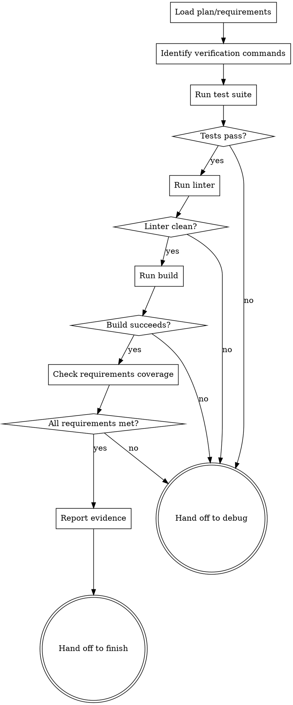

# Verification Before Completion

## Overview

Verify that implementation meets all requirements with fresh evidence from running verification commands. No completion claims without proof. Every test run, every build command, every requirement checked — BEFORE saying "done".

<HARD-GATE>
You MUST run EVERY verification command and READ its full output BEFORE making ANY claim about the state of the implementation. "Should pass", "probably works", "looks good" are FORBIDDEN until you have evidence.
</HARD-GATE>

## The Iron Law

```
NO COMPLETION CLAIMS WITHOUT FRESH VERIFICATION EVIDENCE
```

Confidence is not evidence. Inspection is not execution. Partial checks prove nothing. Run every verification command, read its full output, verify the claim, THEN and only then make the claim.

## Checklist

1. **Load requirements** — read plan/design doc to know what success looks like
2. **Run test suite** — execute ALL tests, check for failures/warnings
3. **Run linter** — execute linter, check for errors/warnings
4. **Run build** — execute build command, verify compilation succeeds
5. **Check requirements coverage** — compare implementation against plan item-by-item
6. **Report with evidence** — show command output, not assumptions
7. **Hand off** — to superpower-finish (pass) or superpower-debug (fail)

## Process Flow



## The Process

### Step 1: Load Requirements

Read the plan or design document to understand what success looks like:

```bash
# Find the plan file
ls docs/plans/

# Read it
cat docs/plans/2026-02-20-feature-name-plan.md
```

Extract the specific requirements:
- What features should work?
- What tests should pass?
- What files should exist?
- What commands should succeed?

### Step 2: Identify Verification Commands

Based on the project type, determine what needs to run:

**Node.js/TypeScript project:**
```bash
npm test          # Test suite
npm run lint      # Linter
npm run build     # Build/compile
```

**Python project:**
```bash
pytest            # Test suite
pylint src/       # Linter
python -m build   # Build
```

**Go project:**
```bash
go test ./...     # Test suite
golint ./...      # Linter
go build ./...    # Build
```

### Step 3: Run Each Verification Command

This is the CRITICAL phase. You must:

1. **IDENTIFY** the exact command to run
2. **RUN** it (not simulate, not predict)
3. **READ** the full output (not just exit code)
4. **VERIFY** your claim (failures, warnings, counts)

#### Gate Function Pattern

```
CLAIM: "All tests pass"

IDENTIFY: What's the test command?
  → Check package.json scripts
  → Found: "npm test"

RUN: Execute it
  → npm test

READ: Full output
  → ✓ 15 tests passed
  → ✓ 0 tests failed
  → ✓ 0 tests skipped
  → Coverage: 85%

VERIFY: Does output support claim?
  → Yes: 0 failures, all 15 passed

THEN: Make claim with evidence
  → "All 15 tests pass (npm test output shown above)"
```

### Step 4: Run Test Suite

**Example: Running tests properly**

<Good>
```bash
# Run tests and capture full output
npm test

# Output:
# PASS  src/utils.test.ts
#   ✓ formatDate formats ISO dates correctly (3 ms)
#   ✓ formatDate handles invalid input (1 ms)
# PASS  src/api.test.ts
#   ✓ fetchUser returns user data (5 ms)
#   ✓ fetchUser handles network errors (2 ms)
#
# Test Suites: 2 passed, 2 total
# Tests:       4 passed, 4 total
# Snapshots:   0 total
# Time:        2.451 s

✅ All 4 tests pass. Test suite: 2 passed, 2 total.
```
</Good>

<Bad>
```bash
# DON'T: Skip running tests
"The tests should pass since we implemented according to TDD."

# DON'T: Run partial tests
npm test src/utils.test.ts
# (misses src/api.test.ts)

# DON'T: Ignore warnings
npm test
# Output:
#   ✓ 4 tests passed
#   ⚠ 2 tests skipped
"All tests pass!" ← WRONG, skipped tests are a problem
```
</Bad>

### Step 5: Run Linter

**Example: Linter verification**

<Good>
```bash
npm run lint

# Output:
# ✓ No linting errors found
# ✓ No warnings
# ✓ All files checked: 12

✅ Linter clean. No errors or warnings.
```
</Good>

<Bad>
```bash
npm run lint

# Output:
# ⚠ Warning: unused variable 'temp' in src/utils.ts:42
# ⚠ Warning: missing return type in src/api.ts:15

"Linter passed!" ← WRONG, warnings exist
```
</Bad>

### Step 6: Run Build

**Example: Build verification**

<Good>
```bash
npm run build

# Output:
# Building...
# ✓ Compiled successfully
# ✓ dist/index.js created (42KB)
# ✓ dist/index.d.ts created (8KB)
# Build complete in 1.2s

✅ Build succeeds. Artifacts created: dist/index.js (42KB), dist/index.d.ts (8KB).
```
</Good>

<Bad>
```bash
npm run build

# Output:
# Building...
# ✓ Compiled successfully
# ⚠ Type declaration generation failed
# Build complete in 1.2s

"Build successful!" ← WRONG, type declarations failed
```
</Bad>

### Step 7: Check Requirements Coverage

Go through the plan item-by-item and verify each requirement:

**Plan said:**
> Task 3: Add formatDate function to src/utils.ts
> Expected output: "2024-01-15" for input Date(2024, 0, 15)

**Verification:**
```bash
# Check function exists
grep -n "formatDate" src/utils.ts
# 15:export function formatDate(date: Date): string {

# Check test exists
grep -n "formatDate" src/utils.test.ts
# 8:  it('formats dates correctly', () => {
# 9:    expect(formatDate(new Date(2024, 0, 15))).toBe('2024-01-15');

# Run test
npm test -- src/utils.test.ts
# ✓ formats dates correctly

✅ Requirement met: formatDate function exists, tested, produces correct output.
```

### Step 8: Report with Evidence

Structure your report:

```markdown
## Verification Report

### Test Suite
**Command:** npm test
**Result:** ✅ PASS
**Evidence:**
- Test Suites: 2 passed, 2 total
- Tests: 4 passed, 4 total
- Coverage: 85%
- No failures, no skipped tests

### Linter
**Command:** npm run lint
**Result:** ✅ PASS
**Evidence:**
- No errors
- No warnings
- 12 files checked

### Build
**Command:** npm run build
**Result:** ✅ PASS
**Evidence:**
- Compiled successfully
- Artifacts created: dist/index.js (42KB), dist/index.d.ts (8KB)

### Requirements Coverage
**Plan:** docs/plans/2026-02-20-feature-name-plan.md
**Result:** ✅ ALL MET

| Requirement | Status | Evidence |
|-------------|--------|----------|
| Task 1: Add formatDate function | ✅ | Function exists in src/utils.ts:15, test passes |
| Task 2: Add fetchUser function | ✅ | Function exists in src/api.ts:8, test passes |
| Task 3: Update README | ✅ | README.md updated, mentions new functions |

### Conclusion
All verification checks passed. Implementation is complete and correct.
Ready to hand off to superpower-finish.
```

### Step 9: Hand Off

Use the appropriate handoff button:
- **All checks passed** → Hand off to superpower-finish
- **Any check failed** → Hand off to superpower-debug

## Good vs Bad Examples

### Example 1: Test Verification

<Good>
```bash
# Actually run the tests
npm test

# Output shows:
# Test Suites: 3 passed, 3 total
# Tests:       12 passed, 12 total

"All 12 tests pass. Test suites: 3 passed, 3 total."
```
Evidence-based claim with specifics.
</Good>

<Bad>
```bash
# DON'T skip running tests
"I reviewed the test files and they look good. They should pass."
```
Inspection ≠ Execution. Must actually run them.
</Bad>

### Example 2: Build Verification

<Good>
```bash
npm run build
# Output:
# ✓ Compiled successfully
# ✓ 0 errors
# ✓ 0 warnings

"Build succeeds with 0 errors and 0 warnings."
```
Ran command, quoted exact output.
</Good>

<Bad>
```bash
# DON'T rely on editor
"VS Code shows no TypeScript errors, so the build should work."
```
Editor ≠ Compiler. Must run actual build command.
</Bad>

### Example 3: Requirements Coverage

<Good>
```markdown
Plan Task 1: "Add login function to src/auth.ts"

Verification:
1. grep -n "function login" src/auth.ts
   → 42:export function login(username: string, password: string): Promise<User> {
2. Test exists: src/auth.test.ts line 15
3. Test passes: npm test -- auth.test.ts
   → ✓ login authenticates valid users

✅ Task 1 complete and verified.
```
Checked function exists, test exists, test passes.
</Good>

<Bad>
```markdown
Plan Task 1: "Add login function to src/auth.ts"

Verification:
"I added the login function as requested."
```
Didn't verify it actually works or has tests.
</Bad>

## Red Flags — STOP

If you catch yourself thinking:

- **"The tests should pass"** — STOP. Should ≠ Do. Run them.
- **"I'm confident it works"** — STOP. Confidence ≠ Evidence. Verify it.
- **"The editor shows no errors"** — STOP. Editor ≠ Compiler. Run build.
- **"I checked a few things"** — STOP. Partial check proves nothing. Check all.
- **"Just this once, skip verification"** — STOP. No exceptions. Ever.
- **"It's probably fine"** — STOP. Probably ≠ Verified. Run the commands.
- **"Let me express satisfaction first"** — STOP. Verify BEFORE expressing anything.

## Common Rationalizations

| Excuse | Reality |
|--------|---------|
| "I'm confident the tests pass" | Confidence is not evidence. Run them. |
| "The linter is just warnings" | Warnings are issues. Fix or document why ignored. |
| "VS Code shows no errors" | Editor ≠ Compiler. Run build command. |
| "I only changed one line" | Small changes break systems. Verify everything. |
| "We're in a hurry" | Skipping verification creates more delays when it breaks. |
| "I'll verify it later" | Later never comes. Verify now. |
| "The tests are flaky anyway" | Flaky tests are technical debt. Fix them, don't skip. |
| "Partial verification is enough" | Partial check proves nothing. Run full suite. |
| "I already know what the output will be" | You don't. Assumptions are wrong. Run the command. |

## Verification Checklist

Before making any completion claim, verify:

- [ ] Ran full test suite (not just one file)
- [ ] Read test output completely (not just exit code)
- [ ] Checked for failures, warnings, skipped tests
- [ ] Ran linter on all affected files
- [ ] Verified linter output is clean (no errors, no warnings)
- [ ] Ran build command (not just editor check)
- [ ] Verified build artifacts were created
- [ ] Loaded plan/requirements document
- [ ] Checked each requirement item-by-item
- [ ] Verified each requirement with evidence
- [ ] Documented evidence in report
- [ ] Did NOT claim success before verification
- [ ] Did NOT express satisfaction before verification
- [ ] Did NOT skip any verification step

## Integration

**Hands off to:**
- superpower-finish (when all verification passes)
- superpower-debug (when any verification fails)

**Called by:**
- superpower-execute (after implementing plan tasks)
- Any agent that needs to verify work before claiming completion
