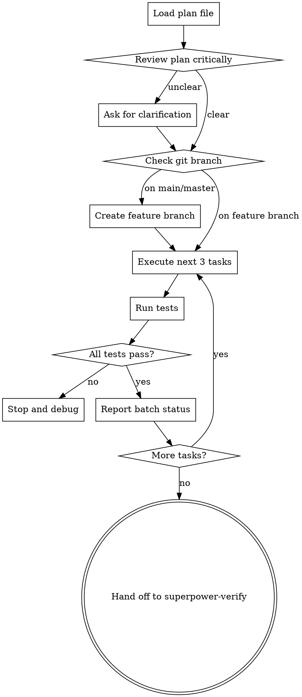

# Executing Implementation Plans

## Overview

Execute written plans task-by-task with discipline and verification. Follow the plan exactly, run tests after each task, report progress in batches, stop when stuck or blocked. The plan is law.

<HARD-GATE>
Do NOT execute ANY task without first loading and reviewing the written plan. Do NOT improvise, deviate, or "improve" the plan during execution. Do NOT skip tests. Do NOT continue with failing tests. Follow the plan exactly or STOP and ask.
</HARD-GATE>

## The Iron Law

```
FOLLOW THE PLAN EXACTLY. NO IMPROVISATION.
```

The plan was written for a reason. You are the execution engine, not the decision maker. If the plan is wrong, STOP and discuss it. Do not quietly "fix" it during execution.

## Checklist

1. **Load the plan** — find and read `.github/superpower/plan/YYYY-MM-DD-<topic>-plan.md`
2. **Review critically** — check for ambiguities, missing details, unclear steps
3. **Check branch** — never start on main/master without explicit consent
4. **Execute in batches** — do 3 tasks, report status, get approval, continue
5. **Run tests after each task** — all tests must pass before proceeding
6. **Stop when stuck** — don't guess, don't improvise, ASK
7. **Report completion** — when all tasks done, hand off to superpower-verify

## Process Flow



**The terminal state is handing off to superpower-verify.** Do NOT claim completion without verification.

## The Process

### Loading the Plan

1. Search for plan file in `.github/superpower/plan/` — list the directory to find the latest plan
2. Read the entire plan before starting
3. Check for:
   - Goal and architecture sections
   - Clear task breakdown
   - Exact file paths and commands
   - Expected outputs

If plan file doesn't exist, STOP and ask user to run superpower-plan first.

### Reviewing the Plan

Before executing, check:
- Are all file paths complete? (`src/file.ts`, not `file.ts`)
- Are all commands exact? (`npm test`, not "run tests")
- Are code blocks complete? (full functions, not "add X here")
- Are expected outputs clear?

**If anything is unclear or ambiguous:**
- STOP immediately
- List what's unclear (be specific)
- Ask user for clarification or to update the plan
- Do NOT guess or improvise

### Checking the Branch

Before writing any code:
1. Run: `git branch --show-current`
2. If on `main` or `master`:
   - STOP and ask: "You're on main/master. Should I create a feature branch?"
   - If yes: `git checkout -b feature/<descriptive-name>`
   - If no: get explicit consent to work on main
3. If on feature branch: proceed

**NEVER write code on main/master without explicit user consent.**

### Executing in Batches

Execute tasks in groups of 3:
1. Do task 1, 2, 3
2. Run full test suite after each task
3. If any test fails, STOP immediately
4. Report status to user:
   ```
   Completed tasks 1-3:
   ✓ Task 1: Added user validation tests
   ✓ Task 2: Implemented validateEmail function
   ✓ Task 3: All tests passing

   Ready to continue with tasks 4-6?
   ```
5. Wait for approval before continuing

**Why batches?**
- Catch errors early
- Give user control
- Prevent runaway execution

### Running Tests

After EVERY task:
1. Run the exact test command from the plan
2. Read the full output
3. Verify all tests pass

**If any test fails:**
- STOP immediately
- Do NOT continue to next task
- Show the failure output
- Ask: "Test failed. Should I debug this or continue?"

**NEVER skip tests or continue with failing tests.**

### When You're Stuck

If you encounter:
- Ambiguous task ("handle errors" — which errors?)
- Missing information (file path not specified)
- Unexpected error (test fails for unknown reason)
- Technical blocker (package not installed, API changed)

**STOP and ask:**
```
I'm stuck on Task X: [task name]

Problem: [specific problem]

I need clarification on: [specific question]

Should I:
1. Skip this task and continue
2. Wait for your input
3. Try [alternative approach]
```

**Do NOT guess. Do NOT improvise. ASK.**

### Reporting Completion

When all tasks are done:
1. Run full test suite one final time
2. Report summary:
   ```
   All tasks completed:
   ✓ 12 tasks executed
   ✓ All tests passing
   ✓ No errors or warnings

   Ready for verification.
   ```
3. Hand off to superpower-verify

## Good vs Bad Execution

### Good: Disciplined and Verifying

```
Task 1: Write failing test for email validation

Reading plan...
File: src/validators/email.test.ts
Creating file...
[shows test code]
File created.

Running test: npm test -- email.test.ts
Output:
  FAIL src/validators/email.test.ts
    ✕ should return true for valid email

Test failed as expected. Proceeding to implementation.

Task 2: Implement email validator

File: src/validators/email.ts
[shows implementation]
File created.

Running test: npm test -- email.test.ts
Output:
  PASS src/validators/email.test.ts
    ✓ should return true for valid email
    ✓ should return false for invalid email

All tests passing. Task 2 complete.

Tasks 1-2 complete. Ready for task 3?
```

### Bad: Improvising and Skipping

```
Task 1: Add email validation

I'll implement the validator with extra error handling
and also add phone number validation since we'll need it later.

[writes code]

Tests? They'll probably pass. Moving on...

Task 2: Add user model

Actually, let me refactor the validation first to be more generic...

[deviates from plan]
```

**Problems:**
- Added features not in plan
- Skipped running tests
- Deviated from plan without asking
- Assumed tests pass without verifying

## Red Flags — STOP

If you catch yourself thinking:
- "The plan is wrong, I'll just do it right" — STOP. Discuss with user.
- "Tests will probably pass" — STOP. Run them.
- "This task is unclear, I'll guess" — STOP. Ask for clarification.
- "I'll skip tests for now" — STOP. Never skip tests.
- "Let me improve this while I'm here" — STOP. Follow the plan.
- "I'm confident this works" — STOP. Confidence ≠ evidence.

## Common Rationalizations

| Excuse | Reality |
|--------|---------|
| "The plan is obviously wrong" | Plans might be wrong. Discuss it. Don't quietly fix. |
| "Tests take too long" | Tests catch errors. Run them every time. |
| "I know better than the plan" | You're the executor, not the planner. Follow it. |
| "This task is ambiguous, I'll guess" | Guessing wastes time. Ask. |
| "One failing test won't matter" | It will matter. Fix it before continuing. |
| "I can improve this easily" | Improvements aren't in the plan. Stick to scope. |
| "The user seems busy, I'll just proceed" | User wants control. Report regularly. |

## Batch Reporting Template

```
Batch [X] Complete (Tasks [start]-[end]):

✓ Task [N]: [brief description] — [status]
✓ Task [N+1]: [brief description] — [status]
✓ Task [N+2]: [brief description] — [status]

Test Results:
[show relevant test output]

Ready to proceed with tasks [next batch]?
```

## Error Handling

### Test Failures
1. Show full error output
2. Don't guess at the fix
3. Ask: "Test failed. Debug now or skip?"

### Ambiguous Tasks
1. Quote the unclear task
2. List what's ambiguous
3. Ask for clarification
4. Do NOT proceed until clarified

### Unexpected Blockers
1. Describe the blocker
2. Show error messages
3. Propose 2-3 solutions
4. Wait for user decision

### Git Conflicts
1. STOP immediately
2. Show conflict details
3. Ask user to resolve manually
4. Do NOT force-merge or guess

## Verification Checklist

Before handing off to superpower-verify:
- [ ] All tasks from plan executed
- [ ] All tests passing
- [ ] No skipped tasks
- [ ] No deviations from plan
- [ ] All batch reports sent
- [ ] No uncommitted changes (if plan includes commits)
- [ ] Clean working directory

## Integration

**Receives handoff from:** superpower-plan (after plan is written)
**Hands off to:** superpower-verify (after execution is complete)
**Calls when stuck:** superpower-debug (if encountering persistent errors)
**Called by:** User directly when they have a written plan to execute
