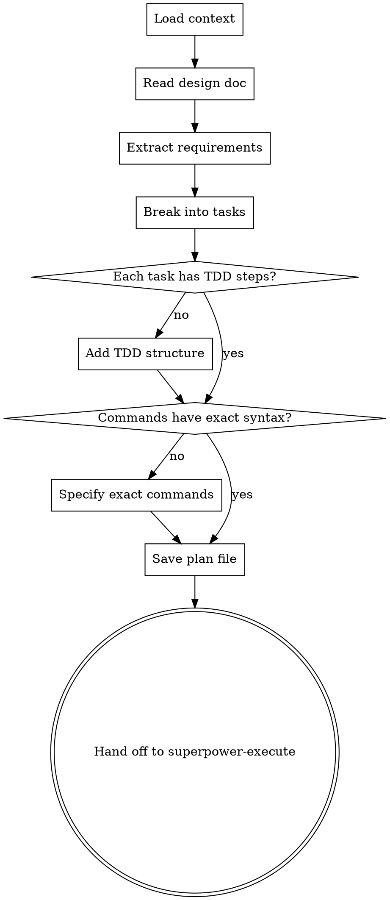

# Writing Implementation Plans

## Overview

Transform approved designs into concrete, executable implementation plans. Every task must be bite-sized with exact file paths, complete code, and expected outputs. Plans guide execution agents step-by-step through TDD cycles.

<HARD-GATE>
Do NOT write any plan without first reading the design document or requirements. Do NOT skip to execution. Every plan must follow the TDD pattern: write test → run test → see it fail → implement code → run test → see it pass.
</HARD-GATE>

## The Iron Law

```
NO CODE WITHOUT A WRITTEN PLAN FIRST
```

Designs tell you WHAT to build. Plans tell you HOW to build it, step by step. Even if the design is clear, you still need a plan that breaks it into executable tasks.

## Checklist

1. **Load project context** — read design doc, check existing code, understand architecture
2. **Review design document** — extract requirements, constraints, success criteria
3. **Break into bite-sized tasks** — each task is ONE action (write test, run it, implement, run again)
4. **Apply TDD structure** — every feature task has: failing test step → minimal implementation step → passing test step
5. **Write exact commands** — no "run tests", say "npm test" with expected output shown
6. **Include plan header** — Goal, Architecture, Tech Stack
7. **Save plan** — to `docs/plans/YYYY-MM-DD-<topic>-plan.md`
8. **Hand off to execute** — use the handoff button to transition to superpower-execute

## Process Flow



**The terminal state is handing off to superpower-execute.** Do NOT execute the plan yourself.

## The Process

### Loading Context

Before writing a plan, understand what exists:
- Read the design document (required)
- Check project structure (`tree` or `ls -R`)
- Examine existing code patterns (imports, test structure, build tools)
- Find build/test commands in `package.json` or `Makefile`

If no design document exists, STOP and ask the user to run superpower-brainstorm first.

### Breaking Into Tasks

**Bite-sized means ONE action per task:**
- ❌ "Add authentication" — too vague
- ✅ "Write failing test for login function"
- ✅ "Run test and verify it fails"
- ✅ "Implement minimal login function"
- ✅ "Run test and verify it passes"

**Each task must specify:**
- Exact file path (`src/auth/login.test.ts`)
- Complete code to add (show full function, not "add error handling")
- Exact command to run (`npm test -- login.test.ts`)
- Expected output (show passing/failing test output)

### TDD Structure

Every feature task follows this pattern:

```
### Task X: [Feature Name]

**Step 1: Write the failing test**
- File: `src/feature.test.ts`
- Code:
  ```typescript
  describe('feature', () => {
    it('should do X when Y', () => {
      expect(feature()).toBe(expected);
    });
  });
  ```

**Step 2: Run test and verify failure**
- Command: `npm test -- feature.test.ts`
- Expected output:
  ```
  FAIL src/feature.test.ts
    ✕ should do X when Y (2 ms)
  ```

**Step 3: Implement minimal code**
- File: `src/feature.ts`
- Code:
  ```typescript
  export function feature() {
    return expected;
  }
  ```

**Step 4: Run test and verify success**
- Command: `npm test -- feature.test.ts`
- Expected output:
  ```
  PASS src/feature.test.ts
    ✓ should do X when Y (2 ms)
  ```
```

### Plan Header

Every plan must start with:

```markdown
# [Project Name] Implementation Plan

**Goal:** One sentence describing what this plan accomplishes

**Architecture:** Key architectural decisions (e.g., "React components + Context API", "REST API + PostgreSQL")

**Tech Stack:** Languages, frameworks, tools used

---
```

### After Writing the Plan

- Save to `docs/plans/YYYY-MM-DD-<topic>-plan.md`
- Use the handoff button to transition to superpower-execute
- Do NOT execute the plan yourself

## Good vs Bad Examples

### Good: Specific and Executable

```markdown
### Task 1: Add user validation

**Step 1: Write failing test for email validation**
- File: `src/validators/email.test.ts`
- Code:
  ```typescript
  import { validateEmail } from './email';

  describe('validateEmail', () => {
    it('should return true for valid email', () => {
      expect(validateEmail('user@example.com')).toBe(true);
    });

    it('should return false for invalid email', () => {
      expect(validateEmail('notanemail')).toBe(false);
    });
  });
  ```

**Step 2: Run test**
- Command: `npm test -- email.test.ts`
- Expected: Test fails (function doesn't exist)

**Step 3: Implement validator**
- File: `src/validators/email.ts`
- Code:
  ```typescript
  export function validateEmail(email: string): boolean {
    return /^[^\s@]+@[^\s@]+\.[^\s@]+$/.test(email);
  }
  ```

**Step 4: Run test**
- Command: `npm test -- email.test.ts`
- Expected: All tests pass
```

### Bad: Vague and Unexecutable

```markdown
### Task 1: Add user validation

- Create email validator
- Write tests
- Make sure it works
- Add error handling
```

**Problems:**
- No file paths
- No code shown
- No commands
- "Make sure it works" — how?
- "Add error handling" — what errors? Where?

## Red Flags — STOP

If you catch yourself writing:
- "Add feature X" without breaking it into test/implement steps — Too vague
- "Run tests" without exact command — Executors need exact syntax
- "Handle edge cases" without specifying which ones — Name them explicitly
- "Update the code" without showing complete code — Show full functions
- "This step is obvious" — Nothing is obvious. Write it down.

## Common Rationalizations

| Excuse | Reality |
|--------|---------|
| "This is too simple to need TDD steps" | TDD prevents shortcuts. Follow it always. |
| "The executor will know what to do" | Executors follow plans literally. Be explicit. |
| "I don't need to show full code" | Plans must be copy-paste executable. |
| "Tests can come later" | No. Tests come FIRST, in the plan. |
| "Edge cases are obvious" | List them or they'll be forgotten. |
| "The user doesn't need this detail" | Plans are for machines, not humans. Detail matters. |

## Task Granularity Rules

**One task = one action:**
- Write one test file ✅
- Run one command ✅
- Add one function ✅
- Commit changes ✅

**NOT one task:**
- "Implement authentication" (split into 10+ tasks)
- "Add tests and implementation" (split into separate tasks)
- "Refactor and optimize" (what specifically?)

**Ask yourself:** Can this task be executed by typing exactly what's written, without making decisions? If no, split it.

## Verification Checklist

Before handing off:
- [ ] Design document read and understood
- [ ] Every feature task has TDD structure (test → fail → implement → pass)
- [ ] Every task has exact file paths
- [ ] Every code block is complete (not "add X here")
- [ ] Every command is exact (`npm test`, not "run tests")
- [ ] Expected outputs shown for commands
- [ ] Plan saved to `docs/plans/YYYY-MM-DD-<topic>-plan.md`
- [ ] Plan header includes Goal, Architecture, Tech Stack

## Integration

**Receives handoff from:** superpower-brainstorm (after design approval)
**Hands off to:** superpower-execute (after plan is written)
**Called by:** User directly when they have requirements but no plan yet
