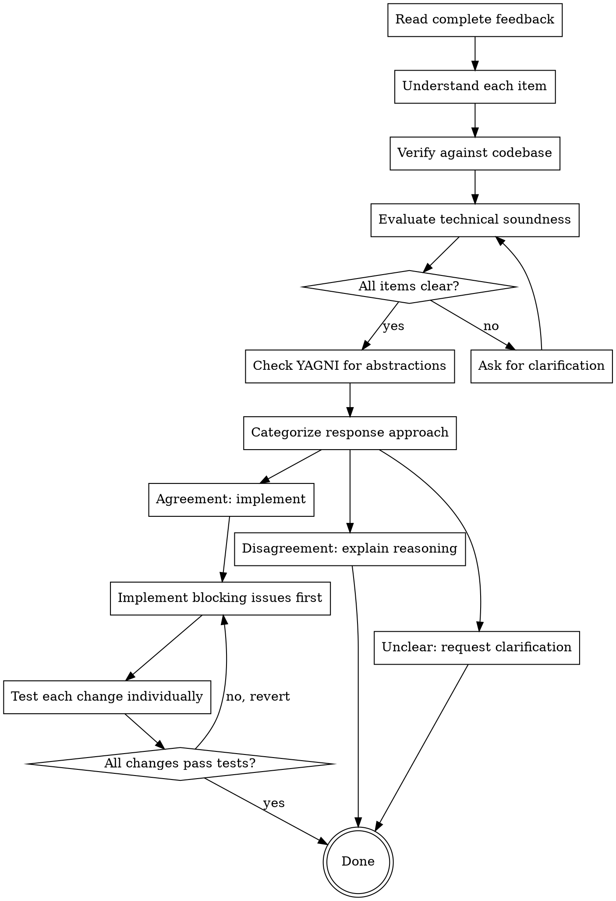

# Code Review Response Protocol

## Overview

Respond to code review feedback with technical correctness over social comfort. Verify suggestions against the codebase. Push back when reviewer is wrong. Implement changes systematically, testing each individually.

<HARD-GATE>
VERIFY BEFORE IMPLEMENTING. TECHNICAL CORRECTNESS OVER SOCIAL COMFORT. Never implement feedback blindly. Never respond with performative agreement. Question suggestions that break functionality or violate YAGNI.
</HARD-GATE>

## The Iron Law

```
VERIFY BEFORE IMPLEMENTING
TECHNICAL CORRECTNESS OVER SOCIAL COMFORT
```

Your job is to evaluate feedback technically, not to please the reviewer. A good response might be "I disagree because X" when the reviewer is wrong. Blind implementation of bad suggestions makes the code worse.

## Checklist

1. **Read complete feedback** — all sections, all line references
2. **Understand each item** — restate in own words, verify understanding
3. **Verify against codebase** — check current implementation, grep for usage
4. **Evaluate technical soundness** — does suggestion actually improve code?
5. **YAGNI check** — is feature/abstraction actually used?
6. **Respond or push back** — agree with evidence, or disagree with reasoning
7. **Implement one at a time** — blocking issues → simple fixes → complex fixes
8. **Test each change** — verify individual changes don't break anything

## Process Flow



## The Process

### Step 1: Read Complete Feedback

**Read everything:**
- Strengths section (understand what was done well)
- All Critical issues
- All Important issues
- All Minor issues
- The overall assessment

**Don't skip anything:**
- Minor issues might reveal patterns
- Assessment might have important context
- Strengths help understand reviewer's perspective

### Step 2: Understand Each Item

**For each piece of feedback:**
- Restate it in your own words
- Identify the specific concern
- Understand the suggested solution
- Note the line reference

**If anything is unclear:**
- STOP
- Ask for clarification on ALL unclear items
- Don't proceed until you understand every piece of feedback
- Don't implement partially understood feedback

### Step 3: Verify Against Codebase

**Check current implementation:**
- Read the code at the referenced line
- Understand the current behavior
- Check surrounding context
- Verify reviewer's understanding is correct

**For YAGNI concerns:**
- Grep the codebase for usage: `grep -r "functionName" src/`
- Check if feature is actually called anywhere
- Verify if abstraction is actually needed
- Don't implement "proper" solutions for unused code

**For security concerns:**
- Verify the vulnerability actually exists
- Check if there's existing protection elsewhere
- Understand the attack vector

### Step 4: Evaluate Technical Soundness

**Ask yourself:**
- Does this suggestion actually improve the code?
- Does it fix a real issue or a perceived issue?
- Will it break existing functionality?
- Is it consistent with the rest of the codebase?
- Does it violate YAGNI?

**Red flags in feedback:**
- "Should be more generic" (but no usage beyond current case)
- "Should handle X" (but X never happens in this system)
- "Should use pattern Y" (but pattern doesn't fit this case)
- "Not following best practice" (but suggestion breaks functionality)

### Step 5: Categorize Response Approach

**Agreement (implement):**
- Feedback identifies real issue
- Suggestion is technically sound
- Implementation won't break functionality
- Consistent with codebase patterns

**Disagreement (push back):**
- Suggestion breaks functionality
- Reviewer lacks context about system
- Suggestion violates YAGNI
- Better alternative exists

**Unclear (request clarification):**
- Feedback is ambiguous
- Multiple interpretations possible
- Unclear what the actual issue is
- Unclear what the expected behavior should be

### Step 6: Respond or Push Back

**For items you agree with:**
- Acknowledge the issue
- Explain your implementation approach
- Show evidence it fixes the issue

**For items you disagree with:**
- Explain your reasoning clearly
- Provide evidence (grep output, test results)
- Offer alternative solution if applicable
- Be respectful but firm

**FORBIDDEN responses:**
- "You're absolutely right!" (performative agreement)
- "Great point!" (empty praise)
- "I'll implement that right away!" (blind acceptance)
- Any response that doesn't show you verified the feedback

**GOOD responses:**
- "I checked the code and you're right, [line X] is missing validation. I'll add it."
- "I disagree with [suggestion] because [technical reason]. The current implementation is correct because [evidence]."
- "Can you clarify what you mean by [unclear feedback]? I see two possible interpretations..."

### Step 7: Implement Changes Systematically

**Implementation order:**
1. **Blocking issues** (security, correctness, missing requirements)
2. **Simple fixes** (naming, validation, error handling)
3. **Complex fixes** (refactoring, architectural changes)

**For each change:**
- Implement ONE change at a time
- Run tests immediately after change
- If tests fail, revert and investigate
- Don't batch unrelated changes

**Don't implement:**
- Suggestions you disagree with (push back instead)
- Unclear feedback (request clarification instead)
- "Nice to have" features (YAGNI)

### Step 8: Verify Each Change

**After each implementation:**
```bash
# Run the specific test for this area
npm test -- path/to/test

# If that passes, run all tests
npm test

# Check for regressions
npm run lint
npm run build
```

**If tests fail:**
- Revert the change
- Investigate why it failed
- Fix the implementation
- Test again

## Red Flags — STOP

If you catch yourself thinking:
- "The reviewer is always right" — Not always. Verify first.
- "I should implement this to be helpful" — Helpful ≠ correct
- "This will make them happy" — Code quality > social comfort
- "Quick agreement moves things along" — Blind agreement creates bugs
- "They're more experienced, they must know" — Experience doesn't mean context
- "I'll just try it and see" — Understand before implementing

## Common Rationalizations

| Excuse | Reality |
|--------|---------|
| "Reviewer is more experienced" | Experience ≠ context about this code |
| "Don't want to seem difficult" | Technical correctness is your job |
| "Quick agreement is polite" | Blind agreement wastes time |
| "They probably know better" | Verify, don't assume |
| "I'll implement now, discuss later" | Discuss now, implement after consensus |
| "Just a suggestion, not a requirement" | Still needs verification |
| "It's minor, doesn't matter" | Minor bugs are still bugs |

## Good Examples

### Example 1: Push Back with Evidence

```
GOOD:
Reviewer: "The formatPhoneNumber function should be more generic to handle international formats"
Agent: "I checked usage with `grep -r 'formatPhoneNumber' src/` and found it's only called
once, in the US phone validation flow. The requirements document specifies US-only support
for v1. Making it generic now would violate YAGNI - we'd be adding complexity for a case
that doesn't exist. If we need international support in v2, we can refactor then with
actual requirements to guide the implementation."

BAD:
Agent: "You're absolutely right! Let me make it more generic."
[Blind agreement without checking usage or requirements]
```

### Example 2: Request Clarification

```
GOOD:
Reviewer: "The error handling needs improvement"
Agent: "Can you clarify what specific improvement you're suggesting?
I see three possible interpretations:
1. Missing try-catch around async operations
2. Error messages aren't descriptive enough
3. Errors aren't logged properly

Which aspect were you referring to, or is it something else?"

BAD:
Agent: "I'll improve the error handling!"
[Implementing without understanding what needs improvement]
```

### Example 3: Agree and Implement with Verification

```
GOOD:
Reviewer: "Missing null check on line 42"
Agent: "You're right - if the API returns null instead of an array, this will throw.
I'll add: `if (!users) throw new Error('Users API returned null')`
Let me implement and verify...
[implements change]
[runs tests]
Tests pass. The null check is now in place and the error message is descriptive."

BAD:
Agent: "Great catch! Fixed."
[No explanation of the fix, no verification it works]
```

### Example 4: Systematic Implementation

```
GOOD:
Agent: "I'll address the feedback in this order:
1. Critical: Add input validation (line 28) - DONE, tests pass
2. Important: Add null check (line 42) - DONE, tests pass
3. Minor: Rename variable for clarity (line 15) - DONE, tests pass
All changes verified individually. Running full test suite...
All tests pass. ✓"

BAD:
Agent: "Fixed all the issues in one commit."
[Batched changes, can't isolate if something breaks]
```

### Example 5: Disagree with Technical Reasoning

```
GOOD:
Reviewer: "Should use async/await instead of promises"
Agent: "I disagree with converting this to async/await. This is Promise.all() running
multiple operations in parallel. Converting to async/await would make them sequential:
```
// Current (parallel): ~100ms total
Promise.all([fetchA(), fetchB(), fetchC()])

// Suggested (sequential): ~300ms total
const a = await fetchA();
const b = await fetchB();
const c = await fetchC();
```
The current implementation is correct for parallel execution. If you want async/await
while maintaining parallelism, we'd need:
```
const [a, b, c] = await Promise.all([fetchA(), fetchB(), fetchC()])
```
but that's functionally identical to the current code."

BAD:
Agent: "Good point! I'll convert to async/await."
[Blind implementation that makes performance worse]
```

## Verification Checklist

Before claiming feedback is addressed:
- [ ] All feedback items read and understood
- [ ] Each suggestion verified against codebase
- [ ] YAGNI check performed for abstractions
- [ ] Technical soundness evaluated for each item
- [ ] Clear responses provided (agree/disagree/clarify)
- [ ] Disagreements backed by evidence
- [ ] Changes implemented in order (blocking → simple → complex)
- [ ] Each change tested individually
- [ ] All tests pass after changes
- [ ] No performative agreement used

## Integration

**Called by:** superpower-review (receives review feedback in handoff)
**Terminal agent:** No handoffs, returns control to user
