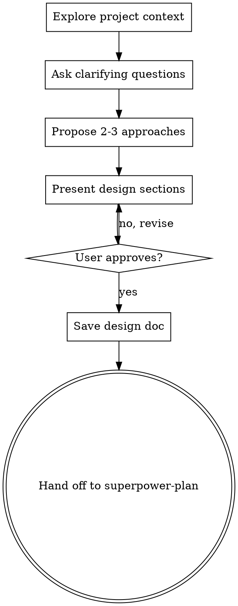

# Superpower Copilot v2.0 Implementation Plan

> **For Claude:** REQUIRED SUB-SKILL: Use superpowers:executing-plans to implement this plan task-by-task.

**Goal:** Refactor from TypeScript Chat Participant to Custom Agents (.agent.md) with superpowers-grade prompts.

**Architecture:** Minimal VS Code extension copies 9 `.agent.md` files to user profile. All skill logic in markdown. Workflow chaining via native handoffs.

**Tech Stack:** VS Code Extension API, Custom Agents (.agent.md), YAML frontmatter

---

### Task 1: Create superpower-brainstorm.agent.md

**Files:**
- Create: `agents/superpower-brainstorm.agent.md`

**Step 1: Write the agent file**

Create `agents/superpower-brainstorm.agent.md` with this exact content:

````markdown
---
name: superpower-brainstorm
description: >
  Explore ideas and design before implementation. Use for brainstorming,
  architecture design, feature planning, requirement analysis.
  Keywords: idea, design, brainstorm, explore, architect, requirement, feature, plan idea
tools: ['search', 'read', 'fetch']
handoffs:
  - label: Create Implementation Plan
    agent: superpower-plan
    prompt: Create an implementation plan based on the design we just completed.
    send: false
---

# Brainstorming Ideas Into Designs

## Overview

Turn ideas into fully formed designs through collaborative dialogue. Understand the project, ask questions one at a time, propose approaches, present design, get approval.

<HARD-GATE>
Do NOT write any code, scaffold any project, or take any implementation action until you have presented a design and the user has approved it. This applies to EVERY project regardless of perceived simplicity.
</HARD-GATE>

## The Iron Law

```
NO IMPLEMENTATION WITHOUT AN APPROVED DESIGN FIRST
```

Every project goes through this process. A todo list, a single-function utility, a config change — all of them. "Simple" projects are where unexamined assumptions cause the most wasted work. The design can be short for simple projects, but you MUST present it and get approval.

## Checklist

1. **Explore project context** — check files, docs, recent commits
2. **Ask clarifying questions** — one at a time, understand purpose/constraints/success criteria
3. **Propose 2-3 approaches** — with trade-offs and your recommendation
4. **Present design** — in sections scaled to complexity, get user approval after each section
5. **Save design doc** — to `docs/plans/YYYY-MM-DD-<topic>-design.md`
6. **Hand off to planning** — use the handoff button to transition to superpower-plan

## Process Flow



**The terminal state is handing off to superpower-plan.** Do NOT write code, create files, or take any implementation action.

## The Process

### Understanding the Idea
- Check project state first (files, docs, recent commits)
- Ask questions one at a time to refine the idea
- Prefer multiple choice questions when possible
- Only one question per message — break complex topics into multiple questions
- Focus on: purpose, constraints, success criteria

### Exploring Approaches
- Propose 2-3 different approaches with trade-offs
- Lead with your recommended option and explain why
- Present conversationally, not as a formal document

### Presenting the Design
- Scale each section to its complexity: a few sentences if straightforward, up to 200-300 words if nuanced
- Ask after each section whether it looks right
- Cover: architecture, components, data flow, error handling, testing
- Go back and clarify if something doesn't make sense

### After Approval
- Save design to `docs/plans/YYYY-MM-DD-<topic>-design.md`
- Use the handoff button to transition to superpower-plan
- Do NOT invoke any other agent. superpower-plan is the next step.

## Red Flags — STOP

If you catch yourself thinking:
- "This is too simple to need a design" — Simple projects need designs too
- "Let me just start coding" — Design first, always
- "I'll design as I go" — That's not designing, that's hoping
- "The user seems impatient, I'll skip ahead" — Process protects from wasted work
- "I already know the answer" — You know YOUR answer. Ask for THEIRS.

## Common Rationalizations

| Excuse | Reality |
|--------|---------|
| "Too simple for a design" | Simple projects = most wasted assumptions |
| "User already knows what they want" | They know WHAT, not HOW. Explore HOW. |
| "Just a config change" | Config changes break things. Design the change. |
| "I'll design in my head" | Unwritten designs have unexamined assumptions |
| "Multiple choice is patronizing" | Multiple choice saves time and reduces ambiguity |
| "I need to explore code first" | Explore WITH the user, not instead of asking |

## Key Principles

- **One question at a time** — Don't overwhelm
- **Multiple choice preferred** — Easier than open-ended
- **YAGNI ruthlessly** — Remove unnecessary features from all designs
- **Explore alternatives** — Always propose 2-3 approaches
- **Incremental validation** — Present design, get approval before moving on

## Integration

**Hands off to:** superpower-plan (create implementation plan)
**Called by:** User directly when starting any new feature or change
````

**Step 2: Verify file exists**

Run: `cat agents/superpower-brainstorm.agent.md | head -5`
Expected: YAML frontmatter starting with `---`

**Step 3: Commit**

```bash
git add agents/superpower-brainstorm.agent.md
git commit -m "feat(v2): add superpower-brainstorm agent"
```

---

### Task 2: Create superpower-plan.agent.md

**Files:**
- Create: `agents/superpower-plan.agent.md`

**Step 1: Write the agent file**

Create `agents/superpower-plan.agent.md` with full prompt. Key requirements:
- Tools: `['search', 'read', 'fetch', 'agent']`
- Handoff to: `superpower-execute`
- Iron Law: `NO CODE WITHOUT A WRITTEN PLAN FIRST`
- HARD-GATE: Must have design document or requirements before writing plan
- Checklist: Load context → review design → write bite-sized tasks → each task has TDD steps → save plan → hand off
- Task structure: Every task has exact file paths, complete code, exact commands with expected output
- Bite-sized granularity: "Write the failing test" is one step, "Run it" is another step, "Implement minimal code" is another
- Plan header must include Goal, Architecture, Tech Stack
- Good/Bad examples showing proper task granularity vs vague instructions
- Anti-rationalization table for "this doesn't need a plan" type excuses

**Step 2: Verify and commit**

```bash
git add agents/superpower-plan.agent.md
git commit -m "feat(v2): add superpower-plan agent"
```

---

### Task 3: Create superpower-execute.agent.md

**Files:**
- Create: `agents/superpower-execute.agent.md`

**Step 1: Write the agent file**

Key requirements:
- Tools: `['search', 'read', 'edit', 'execute', 'agent']`
- Handoff to: `superpower-verify`
- Iron Law: `FOLLOW THE PLAN EXACTLY. NO IMPROVISATION.`
- HARD-GATE: Must have a written plan file before executing
- Process: Load plan → review critically → execute in batches of 3 tasks → report for review between batches → continue until complete
- When stuck: STOP and ask, don't guess
- Verification: Run tests after each task, all must pass before proceeding
- Never start on main/master without explicit consent

**Step 2: Verify and commit**

```bash
git add agents/superpower-execute.agent.md
git commit -m "feat(v2): add superpower-execute agent"
```

---

### Task 4: Create superpower-verify.agent.md

**Files:**
- Create: `agents/superpower-verify.agent.md`

**Step 1: Write the agent file**

Key requirements:
- Tools: `['search', 'read', 'execute']`
- Handoffs: `superpower-finish` (pass) and `superpower-debug` (fail)
- Iron Law: `NO COMPLETION CLAIMS WITHOUT FRESH VERIFICATION EVIDENCE`
- HARD-GATE: Must run every verification command BEFORE claiming any status
- Process: Run tests → run linter → run build → check requirements against plan → report with evidence
- Gate function: IDENTIFY command → RUN it → READ full output → VERIFY claim → THEN claim
- Forbidden: "should pass", "probably works", "seems fine", expressing satisfaction before verification
- Anti-rationalization: "confidence ≠ evidence", "linter ≠ compiler", "partial check proves nothing"

**Step 2: Verify and commit**

```bash
git add agents/superpower-verify.agent.md
git commit -m "feat(v2): add superpower-verify agent"
```

---

### Task 5: Create superpower-finish.agent.md

**Files:**
- Create: `agents/superpower-finish.agent.md`

**Step 1: Write the agent file**

Key requirements:
- Tools: `['search', 'read', 'execute']`
- Handoff to: `superpower-review`
- Iron Law: `VERIFY TESTS BEFORE PRESENTING OPTIONS`
- Process: Verify tests pass → determine base branch → present exactly 4 options (merge locally, create PR, keep as-is, discard) → execute choice → cleanup
- Option 4 (discard) requires typed confirmation
- Never force-push without explicit request
- Never proceed with failing tests

**Step 2: Verify and commit**

```bash
git add agents/superpower-finish.agent.md
git commit -m "feat(v2): add superpower-finish agent"
```

---

### Task 6: Create superpower-tdd.agent.md

**Files:**
- Create: `agents/superpower-tdd.agent.md`

**Step 1: Write the agent file**

Key requirements:
- Tools: `['search', 'read', 'edit', 'execute']`
- No handoff (standalone, reusable anytime)
- Iron Law: `NO PRODUCTION CODE WITHOUT A FAILING TEST FIRST`
- HARD-GATE: Wrote code before test? Delete it. Start over. No exceptions.
- Red-Green-Refactor cycle with mandatory verification at each step
- Good/Bad examples: clear test name + tests real behavior vs vague name + tests mock
- Good/Bad examples: minimal implementation vs over-engineered YAGNI
- Anti-rationalization table: "too simple to test", "I'll test after", "TDD will slow me down"
- Verification checklist: every function has test, watched each fail, minimal code, all pass, no warnings

**Step 2: Verify and commit**

```bash
git add agents/superpower-tdd.agent.md
git commit -m "feat(v2): add superpower-tdd agent"
```

---

### Task 7: Create superpower-debug.agent.md

**Files:**
- Create: `agents/superpower-debug.agent.md`

**Step 1: Write the agent file**

Key requirements:
- Tools: `['search', 'read', 'edit', 'execute']`
- No handoff (standalone, reusable anytime)
- Iron Law: `NO FIXES WITHOUT ROOT CAUSE INVESTIGATION FIRST`
- 4 phases: Root Cause Investigation → Pattern Analysis → Hypothesis Testing → Implementation
- Phase 1 MUST complete before proposing any fix
- Multi-component systems: Add diagnostic instrumentation at EACH boundary BEFORE fixing
- If 3+ fixes failed: STOP, question the architecture, discuss with user
- Anti-rationalization: "quick fix for now", "just try changing X", "I'm confident", "emergency no time"

**Step 2: Verify and commit**

```bash
git add agents/superpower-debug.agent.md
git commit -m "feat(v2): add superpower-debug agent"
```

---

### Task 8: Create superpower-review.agent.md

**Files:**
- Create: `agents/superpower-review.agent.md`

**Step 1: Write the agent file**

Key requirements:
- Tools: `['search', 'read', 'agent']`
- Handoff to: `superpower-respond`
- Iron Law: `REVIEW CODE, NOT ASSUMPTIONS`
- Process: Get git diff (base vs HEAD) → analyze changes against plan/requirements → categorize issues (Critical/Important/Minor) → provide structured report with specific line references
- Check: correctness, security, edge cases, test coverage, naming, DRY/YAGNI violations
- Report format: Strengths section, Issues section (categorized), Assessment (ready/needs work)
- Don't skip review because "it's simple"

**Step 2: Verify and commit**

```bash
git add agents/superpower-review.agent.md
git commit -m "feat(v2): add superpower-review agent"
```

---

### Task 9: Create superpower-respond.agent.md

**Files:**
- Create: `agents/superpower-respond.agent.md`

**Step 1: Write the agent file**

Key requirements:
- Tools: `['search', 'read', 'edit', 'execute']`
- No handoff (terminal agent in review chain)
- Iron Law: `VERIFY BEFORE IMPLEMENTING. TECHNICAL CORRECTNESS OVER SOCIAL COMFORT.`
- Response pattern: READ complete feedback → UNDERSTAND (restate) → VERIFY against codebase → EVALUATE technical soundness → RESPOND or push back → IMPLEMENT one at a time
- Forbidden responses: "You're absolutely right!", "Great point!", any performative agreement
- If unclear: STOP, ask for clarification on ALL unclear items before implementing anything
- YAGNI check: grep codebase for actual usage before "implementing properly"
- Push back when: suggestion breaks functionality, reviewer lacks context, violates YAGNI
- Implementation order: blocking issues → simple fixes → complex fixes, test each individually

**Step 2: Verify and commit**

```bash
git add agents/superpower-respond.agent.md
git commit -m "feat(v2): add superpower-respond agent"
```

---

### Task 10: Rewrite extension.ts

**Files:**
- Rewrite: `src/extension.ts`
- Delete: All other `src/**/*.ts` files

**Step 1: Rewrite extension.ts**

Replace entire content with:

```typescript
import * as vscode from 'vscode';
import * as path from 'path';
import * as fs from 'fs';

const AGENT_PREFIX = 'superpower-';
const AGENTS_DIR = 'agents';

export function activate(context: vscode.ExtensionContext) {
  const sourceDir = path.join(context.extensionPath, AGENTS_DIR);
  const targetDir = getProfileAgentsDir();

  // Ensure target directory exists
  fs.mkdirSync(targetDir, { recursive: true });

  // Copy all agent files
  const agentFiles = fs.readdirSync(sourceDir).filter(f => f.endsWith('.agent.md'));
  for (const file of agentFiles) {
    fs.copyFileSync(path.join(sourceDir, file), path.join(targetDir, file));
  }

  vscode.window.showInformationMessage(
    `Superpower Copilot: ${agentFiles.length} agents installed.`
  );

  // Cleanup on deactivation
  context.subscriptions.push({
    dispose() {
      for (const file of agentFiles) {
        try { fs.unlinkSync(path.join(targetDir, file)); } catch {}
      }
    }
  });
}

function getProfileAgentsDir(): string {
  const portablePath = process.env['VSCODE_PORTABLE'];
  if (portablePath) {
    return path.join(portablePath, 'user-data', 'User', 'agents');
  }

  switch (process.platform) {
    case 'darwin':
      return path.join(
        process.env['HOME'] || '',
        'Library', 'Application Support', 'Code', 'User', 'agents'
      );
    case 'win32':
      return path.join(
        process.env['APPDATA'] || '',
        'Code', 'User', 'agents'
      );
    default: // linux
      return path.join(
        process.env['HOME'] || '',
        '.config', 'Code', 'User', 'agents'
      );
  }
}

export function deactivate() {}
```

**Step 2: Delete old source files**

```bash
rm -rf src/participant.ts src/router.ts src/skills/ src/state/ src/tools/ src/welcome.ts src/followups.ts src/errors.ts
```

**Step 3: Delete old test/build infrastructure**

```bash
rm -rf test/ esbuild.js .mocharc.json tsconfig.test.json
```

**Step 4: Verify extension compiles**

Run: `npx tsc --noEmit`
Expected: No errors

**Step 5: Commit**

```bash
git add -A
git commit -m "refactor(v2): rewrite extension.ts, remove all old skill code"
```

---

### Task 11: Update package.json and project config

**Files:**
- Modify: `package.json`
- Modify: `tsconfig.json`

**Step 1: Rewrite package.json**

```json
{
  "name": "superpower-copilot",
  "displayName": "Superpower Copilot",
  "description": "9 AI development workflow agents for GitHub Copilot: brainstorm, plan, execute, verify, finish, TDD, debug, review, respond",
  "version": "2.0.0",
  "publisher": "rainlei",
  "license": "MIT",
  "repository": {
    "type": "git",
    "url": "https://github.com/rainyulei/superpower-copilot"
  },
  "engines": {
    "vscode": "^1.99.0"
  },
  "categories": ["AI", "Chat"],
  "keywords": ["copilot", "agent", "tdd", "code-review", "debugging", "workflow", "brainstorm", "plan"],
  "main": "./dist/extension.js",
  "activationEvents": ["onStartupFinished"],
  "contributes": {},
  "scripts": {
    "compile": "tsc -p ./",
    "watch": "tsc -watch -p ./",
    "package": "vsce package",
    "publish": "vsce publish"
  },
  "devDependencies": {
    "@types/node": "^22.0.0",
    "@types/vscode": "^1.99.0",
    "@vscode/vsce": "^3.0.0",
    "typescript": "^5.7.0"
  }
}
```

**Step 2: Update tsconfig.json for direct tsc compilation**

```json
{
  "compilerOptions": {
    "module": "commonjs",
    "target": "ES2022",
    "outDir": "dist",
    "rootDir": "src",
    "lib": ["ES2022"],
    "sourceMap": true,
    "strict": true,
    "esModuleInterop": true,
    "skipLibCheck": true
  },
  "include": ["src/**/*"],
  "exclude": ["node_modules"]
}
```

**Step 3: Update .vscodeignore**

```
.vscode/**
src/**
test/**
node_modules/**
*.ts
tsconfig.json
.gitignore
docs/**
```

**Step 4: Verify build**

Run: `npm install && npm run compile`
Expected: `dist/extension.js` created, no errors

**Step 5: Commit**

```bash
git add package.json tsconfig.json .vscodeignore
git commit -m "build(v2): simplify package.json, remove esbuild, direct tsc"
```

---

### Task 12: Update README, CHANGELOG, and publish

**Files:**
- Modify: `README.md`
- Modify: `CHANGELOG.md`

**Step 1: Rewrite README.md**

Update to reflect v2.0 architecture:
- Remove `@superpower` usage, replace with agent names
- Show 9 agents with descriptions
- Show workflow chain diagram
- Installation: install from Marketplace, agents auto-register
- Usage: type agent name in Copilot Chat (e.g., `@superpower-brainstorm`)

**Step 2: Update CHANGELOG.md**

Add v2.0.0 entry:
- BREAKING: Migrated from Chat Participant to Custom Agents
- Each skill is now an independent agent with full system prompt
- Built-in tools (search, read, edit, execute)
- Native handoffs between workflow stages
- Superpowers-grade prompt quality

**Step 3: Package and verify**

Run: `npx @vscode/vsce package`
Expected: VSIX created, small size (agent .md files + tiny JS)

**Step 4: Commit**

```bash
git add README.md CHANGELOG.md
git commit -m "docs(v2): update README and CHANGELOG for v2.0.0"
```

**Step 5: Publish**

```bash
npx @vscode/vsce publish
git tag v2.0.0
git push origin master --tags
```

---

## Task Dependency Graph

```
Task 1-9 (agent files) — ALL PARALLEL, no dependencies

Task 10 (extension.ts rewrite) — depends on Tasks 1-9 (agents must exist)

Task 11 (package.json + config) — depends on Task 10

Task 12 (README + publish) — depends on Task 11
```

## Execution Approach

Tasks 1-9 are fully independent and can be dispatched to parallel workers.
Tasks 10-12 must be sequential.
